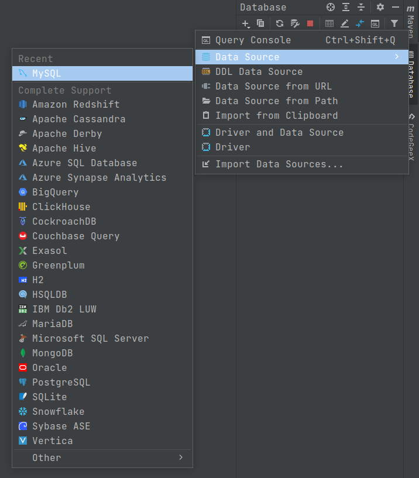
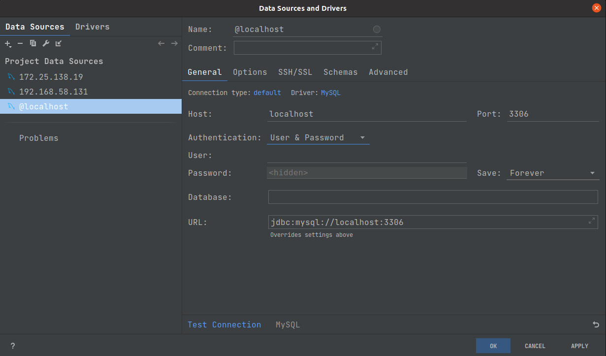
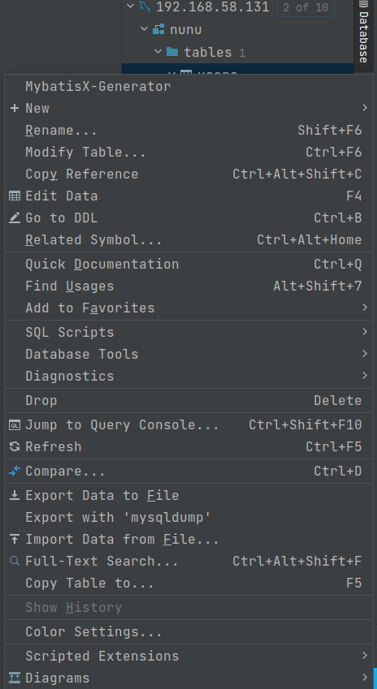
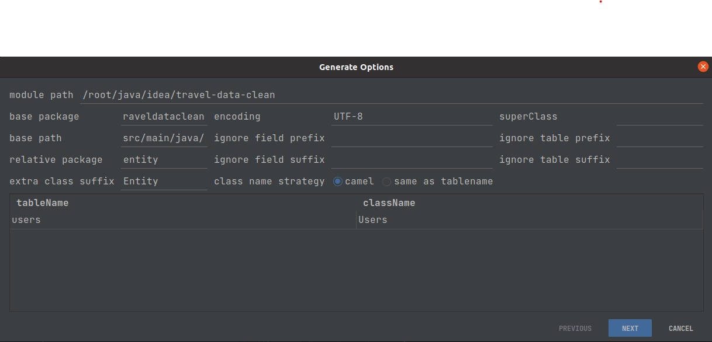
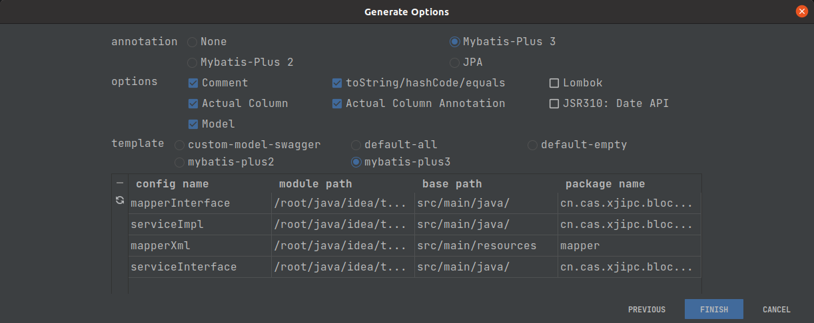

# java语言开发汇总

## MyBatisX插件使用

### 步骤

1. 安装插件

> JetBrains系列IDE软件
>> File -> Settings -> Plugins -> Marketplace -> MyBatisX

2. 连接数据库

> JetBrains系列IDE软件
>> 
>
>> 

3. 选择要逆向生成的表

> 以nunu库user表做演示
> 在user表右键
>> 
> 选择MybatisX-Generator
> 注意点:
> 1 base package 填写 Application所在包名</br>
> 2 base path 保持src/main/java不变</br>
> 3 relative package 实体类包名 如 entity</br>
> 4 extra class suffix 实体类后缀 如 Entity</br>
> 5 class name strategy 选择camel / same as tablename</br>
> > 
> 点击下一步
> 注意点
> 1 annotation 注解类型 按需选</br>
> 2 options 选项 按需选</br>
> 3 template 模板 按需选</br>
> > 
> 点击finish

## mybatis-plus注入 InsertBatchSomeColumn

### mybatis-plus:3.5.3.2

* 引入依赖

```xml

<dependency>
    <groupId>com.baomidou</groupId>
    <artifactId>mybatis-plus-boot-starter</artifactId>
    <version>3.5.3.2</version>
</dependency>
```

* 继承BaseMapper

```java
public interface BatchInsertBaseMapper<T> extends BaseMapper<T> {
    Integer insertBatchSomeColumn(List<T> batchInsertList);
}
```

* 继承DefaultInjector

Tips: 此类不使用@Component

```java
public class EasySqlInjector extends DefaultSqlInjector {
    @Override
    public List<AbstractMethod> getMethodList(Class<?> mapperClass, TableInfo tableInfo) {
        List<AbstractMethod> methodList = super.getMethodList(mapperClass, tableInfo);
        methodList.add(new InsertBatchSomeColumn(i -> i.getFieldFill() != FieldFill.UPDATE));
        return methodList;
    }
}
```

* 注入实现的injector

```java
@Configuration
public class MyBatisPlusBatchInsertConfiguration {
    @Bean
    public MybatisPlusInterceptor mybatisPlusInterceptor() {
        MybatisPlusInterceptor interceptor = new MybatisPlusInterceptor();
        //添加分页插件
        interceptor.addInnerInterceptor(new PaginationInnerInterceptor(DbType.MYSQL));
        //添加乐观锁插件
        interceptor.addInnerInterceptor(new OptimisticLockerInnerInterceptor());
        return interceptor;
    }
    @Bean
    public EasySqlInjector easySqlInjector() {
        return new EasySqlInjector();
    }
}
```

* 使用

Tips: 完成以上步骤后，直接继承已经继承BaseMapper的类(BatchInsertBaseMapper)

```java
@Mapper
public interface FilerecordMapper extends BatchInsertBaseMapper<Filerecord> {
}
```

## spring-boot项目mysql数据库  public key retrieval is not allowed问题解决

### 解决方式

```yaml
# Tips: 在url后加allowPublicKeyRetrieval=true配置
spring:
  datasource:
    url: jdbc:mysql://127.0.0.1:3306/basic?clobAsString=1&useUnicode=true&characterEncoding=utf8&zeroDateTimeBehavior=convertToNull&useSSL=false&serverTimezone=GMT%2B8&allowPublicKeyRetrieval=true
    username: root
    password: 123456
    driver-class-name: com.mysql.cj.jdbc.Driver
```

## mybatis-plus 开启完整日志

```yaml
# Tips: 正式环境请勿打开日志
mybatis-plus:
  mapper-locations: classpath:mapper/*.xml
  configuration:
    log-impl: org.apache.ibatis.logging.stdout.StdOutImpl
```

* 完整sql

```java
@Component
@Intercepts({
        @Signature(
                type = StatementHandler.class,
                method = "prepare",
                args = {
                        Connection.class,
                        Integer.class
                }
        )
})
public class MybatisPlusInterceptor implements Interceptor {
    private static final Logger L = LoggerFactory.getLogger(MybatisPlusInterceptor.class);

    @Override
    public Object plugin(Object target) {
        return Plugin.wrap(target, this);
    }

    @Override
    public void setProperties(Properties properties) {
        //        Interceptor.super.setProperties(properties);
    }

    @Override
    public Object intercept(Invocation invocation) throws Throwable {
        StatementHandler statementHandler = (StatementHandler) invocation.getTarget();
        //通过MetaObject优雅访问对象的属性，这里是访问statementHandler的属性;：
        // MetaObject是Mybatis提供的一个用于方便、
        //优雅访问对象属性的对象，通过它可以简化代码、不需要try/catch各种reflect异常，
        // 同时它支持对JavaBean、Collection、Map三种类型对象的操作。
        MetaObject metaObject = MetaObject.forObject(statementHandler,
                SystemMetaObject.DEFAULT_OBJECT_FACTORY,
                SystemMetaObject.DEFAULT_OBJECT_WRAPPER_FACTORY,
                new DefaultReflectorFactory());
        //先拦截到RoutingStatementHandler，里面有个StatementHandler类型的delegate变量，
        // 其实现类是BaseStatementHandler，
        // 然后就到BaseStatementHandler的成员变量mappedStatement
        MappedStatement mappedStatement = (MappedStatement) metaObject.getValue(
                "delegate.mappedStatement");
        //id为执行的mapper方法的全路径名，如com.uv.dao.UserMapper.insertUser
        String id = mappedStatement.getId();
        L.info("id ==> " + id);
        //sql语句类型 select、delete、insert、update
        String sqlCommandType = mappedStatement.getSqlCommandType().toString();
        L.info("类型 ==> " + sqlCommandType);

        BoundSql boundSql = statementHandler.getBoundSql();

        // 获取节点的配置
        Configuration configuration = mappedStatement.getConfiguration();
        // 获取到最终的sql语句
        String newSql = getSql(configuration, boundSql, id);
        L.info("SQL ==>: " + newSql);
        long start = System.currentTimeMillis();
        Object returnValue = invocation.proceed();
        long end = System.currentTimeMillis();
        long time = (end - start);
        L.info("sql耗时 ==>: " + time);
        return returnValue;
        //        return null;
    }

    /**
     * 封装了一下sql语句，
     * 使得结果返回完整xml路径下的sql语句节点id + sql语句
     *
     * @param configuration:
     * @param boundSql:
     * @param sqlId:
     *
     * @return string
     */
    private String getSql(Configuration configuration, BoundSql boundSql, String sqlId) {
        String sql = showSql(configuration, boundSql);
        return sqlId + ":" + sql;
        //        return sql;
    }

    /**
     * 如果参数是String，则添加单引号， 如果是日期，则转换为时间格式器并加单引号；
     * 对参数是null和不是null的情况作了处理<br>
     *
     * @param obj:
     *
     * @return string
     */
    private String getParameterValue(Object obj) {
        String value;
        if (obj instanceof String) {
            value = "'" + obj + "'";
        } else if (obj instanceof Date) {
            DateFormat formatter = DateFormat.getDateTimeInstance(DateFormat.DEFAULT,
                    DateFormat.DEFAULT, Locale.CHINA);
            value = "'" + formatter.format(new Date()) + "'";
        } else {
            if (obj != null) {
                value = obj.toString();
            } else {
                value = "";
            }

        }
        return value;
    }

    /**
     * 进行？的替换
     *
     * @param configuration:
     * @param boundSql:
     *
     * @return string
     */
    public String showSql(Configuration configuration, BoundSql boundSql) {
        // 获取参数
        Object parameterObject = boundSql.getParameterObject();
        List<ParameterMapping> parameterMappings = boundSql.getParameterMappings();
        // sql语句中多个空格都用一个空格代替
        String sql = boundSql.getSql().replaceAll("[\\s]+", " ");
        if (CollectionUtils.isNotEmpty(parameterMappings) && parameterObject != null) {
            // 获取类型处理器注册器，类型处理器的功能是进行java类型和数据库类型的转换　　　　　　　
            // 如果根据parameterObject.getClass(）可以找到对应的类型，则替换
            TypeHandlerRegistry typeHandlerRegistry = configuration.getTypeHandlerRegistry();
            if (typeHandlerRegistry.hasTypeHandler(parameterObject.getClass())) {
                sql = sql.replaceFirst("\\?",
                        Matcher.quoteReplacement(getParameterValue(parameterObject)));
            } else {
                //MetaObject主要是封装了originalObject对象，
                // 提供了get和set的方法用于获取和设置originalObject的属性值,
                // 主要支持对JavaBean、Collection、Map三种类型对象的操作
                MetaObject metaObject = configuration.newMetaObject(parameterObject);
                for (ParameterMapping parameterMapping : parameterMappings) {
                    String propertyName = parameterMapping.getProperty();
                    if (metaObject.hasGetter(propertyName)) {
                        Object obj = metaObject.getValue(propertyName);
                        sql = sql.replaceFirst("\\?", Matcher.quoteReplacement(getParameterValue(obj)));
                    } else if (boundSql.hasAdditionalParameter(propertyName)) {
                        // 该分支是动态sql
                        Object obj = boundSql.getAdditionalParameter(propertyName);
                        sql = sql.replaceFirst("\\?", Matcher.quoteReplacement(getParameterValue(obj)));
                    } else {
                        //打印出缺失，提醒该参数缺失并防止错位
                        sql = sql.replaceFirst("\\?", "缺失");
                    }
                }
            }
        }
        return sql;
    }

}
```

## spring-boot+mybatis-plus+完整sql日志+批量插入

Tips: 在 <注入实现的injector> 部分 需要修改MybatisPlusInterceptor引包

```java
@Intercepts({
        @Signature(
                type = StatementHandler.class,
                method = "prepare",
                args = {
                        Connection.class,
                        Integer.class
                }
        ),
        @Signature(
                type = StatementHandler.class,
                method = "getBoundSql",
                args = {

                }
        ),
        @Signature(
                type = Executor.class,
                method = "update",
                args = {
                        MappedStatement.class,
                        Object.class
                }
        ),
        @Signature(
                type = Executor.class,
                method = "query",
                args = {
                        MappedStatement.class,
                        Object.class,
                        RowBounds.class,
                        ResultHandler.class
                }
        ),
        @Signature(
                type = Executor.class,
                method = "query",
                args = {
                        MappedStatement.class,
                        Object.class,
                        RowBounds.class,
                        ResultHandler.class,
                        CacheKey.class,
                        BoundSql.class
                }
        ),
})
public class MybatisPlusInterceptor implements Interceptor {

    private static final Logger L = LoggerFactory.getLogger(MybatisPlusInterceptor.class);

    private final List<InnerInterceptor> interceptors = new ArrayList<>();

    public MybatisPlusInterceptor() {
    }

    public void addInnerInterceptor(InnerInterceptor innerInterceptor) {
        this.interceptors.add(innerInterceptor);
    }

    public List<InnerInterceptor> getInterceptors() {
        return Collections.unmodifiableList(interceptors);
    }

    @Override
    public Object intercept(Invocation invocation) throws Throwable {
        Object target = invocation.getTarget();
        Object[] args = invocation.getArgs();
        if (target instanceof Executor) {
            final Executor executor = (Executor) target;
            Object parameter = args[1];
            boolean isUpdate = args.length == 2;
            MappedStatement ms = (MappedStatement) args[0];
            if (! isUpdate && ms.getSqlCommandType() == SqlCommandType.SELECT) {
                RowBounds rowBounds = (RowBounds) args[2];
                ResultHandler resultHandler = (ResultHandler) args[3];
                BoundSql boundSql;
                if (args.length == 4) {
                    boundSql = ms.getBoundSql(parameter);
                } else {
                    // 几乎不可能走进这里面,除非使用Executor的代理对象调用query[args[6]]
                    boundSql = (BoundSql) args[5];
                }
                for (InnerInterceptor query : interceptors) {
                    if (! query.willDoQuery(executor, ms, parameter, rowBounds, resultHandler, boundSql)) {
                        return Collections.emptyList();
                    }
                    query.beforeQuery(executor, ms, parameter, rowBounds, resultHandler, boundSql);
                }
                CacheKey cacheKey = executor.createCacheKey(ms, parameter, rowBounds, boundSql);
                return executor.query(ms, parameter, rowBounds, resultHandler, cacheKey, boundSql);
            } else if (isUpdate) {
                for (InnerInterceptor update : interceptors) {
                    if (! update.willDoUpdate(executor, ms, parameter)) {
                        return - 1;
                    }
                    update.beforeUpdate(executor, ms, parameter);
                }
            }
        } else {
            // StatementHandler
            final StatementHandler statementHandler = (StatementHandler) target;
            //通过MetaObject优雅访问对象的属性，这里是访问statementHandler的属性;：
            // MetaObject是Mybatis提供的一个用于方便、
            //优雅访问对象属性的对象，通过它可以简化代码、不需要try/catch各种reflect异常，
            // 同时它支持对JavaBean、Collection、Map三种类型对象的操作。
            MetaObject metaObject = MetaObject.forObject(statementHandler,SystemMetaObject.DEFAULT_OBJECT_FACTORY,SystemMetaObject.DEFAULT_OBJECT_WRAPPER_FACTORY,new DefaultReflectorFactory());
            //先拦截到RoutingStatementHandler，里面有个StatementHandler类型的delegate变量，
            // 其实现类是BaseStatementHandler，
            // 然后就到BaseStatementHandler的成员变量mappedStatement
            MappedStatement mappedStatement = (MappedStatement) metaObject.getValue("delegate.mappedStatement");
            //id为执行的mapper方法的全路径名，如com.uv.dao.UserMapper.insertUser
            String id = mappedStatement.getId();
            //        L.info("id ==> " + id);
            //sql语句类型 select、delete、insert、update
            String sqlCommandType = mappedStatement.getSqlCommandType().toString();
            //        L.info("类型 ==> " + sqlCommandType);
            BoundSql boundSql = statementHandler.getBoundSql();
            // 获取节点的配置
            Configuration configuration = mappedStatement.getConfiguration();
            // 获取到最终的sql语句
            String newSql = getSql(configuration, boundSql, id);
            //        L.info("SQL ==>: " + newSql);
            L.info("\n====\n\tmethodType: {}\n\tmethodName: {}\n\texecuteSql: {}\n====", id, sqlCommandType, newSql);
            
            // 目前只有StatementHandler.getBoundSql方法args才为null
            if (null == args) {
                for (InnerInterceptor innerInterceptor : interceptors) {
                    innerInterceptor.beforeGetBoundSql(statementHandler);
                }
            } else {
                Connection connections = (Connection) args[0];
                Integer transactionTimeout = (Integer) args[1];
                for (InnerInterceptor innerInterceptor : interceptors) {
                    innerInterceptor.beforePrepare(statementHandler, connections, transactionTimeout);
                }
            }
        }
        return invocation.proceed();

    }

    /**
     * 封装了一下sql语句，
     * 使得结果返回完整xml路径下的sql语句节点id + sql语句
     *
     * @param configuration:
     * @param boundSql:
     * @param sqlId:
     *
     * @return string
     */
    private String getSql(Configuration configuration, BoundSql boundSql, String sqlId) {
        //        return sqlId + ":" + showSql(configuration, boundSql);
        return showSql(configuration, boundSql);
    }

    /**
     * 如果参数是String，则添加单引号， 如果是日期，则转换为时间格式器并加单引号；
     * 对参数是null和不是null的情况作了处理<br>
     *
     * @param obj:
     *
     * @return string
     */
    private String getParameterValue(Object obj) {
        String value;
        if (obj instanceof String) {
            value = "'" + obj + "'";
        } else if (obj instanceof Date) {
            DateFormat formatter = DateFormat.getDateTimeInstance(DateFormat.DEFAULT,
                    DateFormat.DEFAULT, Locale.CHINA);
            value = "'" + formatter.format(new Date()) + "'";
        } else {
            if (obj != null) {
                value = obj.toString();
            } else {
                value = "";
            }

        }
        return value;
    }

    /**
     * 进行？的替换
     *
     * @param configuration:
     * @param boundSql:
     *
     * @return string
     */
    public String showSql(Configuration configuration, BoundSql boundSql) {
        // 获取参数
        Object parameterObject = boundSql.getParameterObject();
        List<ParameterMapping> parameterMappings = boundSql.getParameterMappings();
        // sql语句中多个空格都用一个空格代替
        String sql = boundSql.getSql().replaceAll("[\\s]+", " ");
        if (CollectionUtils.isNotEmpty(parameterMappings) && parameterObject != null) {
            // 获取类型处理器注册器，类型处理器的功能是进行java类型和数据库类型的转换　　　　　　　
            // 如果根据parameterObject.getClass(）可以找到对应的类型，则替换
            TypeHandlerRegistry typeHandlerRegistry = configuration.getTypeHandlerRegistry();
            if (typeHandlerRegistry.hasTypeHandler(parameterObject.getClass())) {
                sql = sql.replaceFirst("\\?",
                        Matcher.quoteReplacement(getParameterValue(parameterObject)));
            } else {
                //MetaObject主要是封装了originalObject对象，
                // 提供了get和set的方法用于获取和设置originalObject的属性值,
                // 主要支持对JavaBean、Collection、Map三种类型对象的操作
                MetaObject metaObject = configuration.newMetaObject(parameterObject);
                for (ParameterMapping parameterMapping : parameterMappings) {
                    String propertyName = parameterMapping.getProperty();
                    if (metaObject.hasGetter(propertyName)) {
                        Object obj = metaObject.getValue(propertyName);
                        sql = sql.replaceFirst("\\?", Matcher.quoteReplacement(getParameterValue(obj)));
                    } else if (boundSql.hasAdditionalParameter(propertyName)) {
                        // 该分支是动态sql
                        Object obj = boundSql.getAdditionalParameter(propertyName);
                        sql = sql.replaceFirst("\\?", Matcher.quoteReplacement(getParameterValue(obj)));
                    } else {
                        //打印出缺失，提醒该参数缺失并防止错位
                        sql = sql.replaceFirst("\\?","缺失");
                    }
                }
            }
        }
        return sql;
    }

    @Override
    public Object plugin(Object target) {
        if (target instanceof Executor || target instanceof StatementHandler) {
            return Plugin.wrap(target, this);
        }
        return target;
    }

    /**
     * 使用内部规则,拿分页插件举个栗子:
     * <p>
     * - key: "@page" ,value: "com.baomidou.mybatisplus.extension.plugins.inner.PaginationInnerInterceptor"
     * - key: "page:limit" ,value: "100"
     * <p>
     * 解读1: key 以 "@" 开头定义了这是一个需要组装的 `InnerInterceptor`, 以 "page" 结尾表示别名
     * value 是 `InnerInterceptor` 的具体的 class 全名
     * 解读2: key 以上面定义的 "别名 + ':'" 开头指这个 `value` 是定义的该 `InnerInterceptor` 属性需要设置的值
     * <p>
     * 如果这个 `InnerInterceptor` 不需要配置属性也要加别名
     */
    @Override
    public void setProperties(Properties properties) {
        PropertyMapper pm = PropertyMapper.newInstance(properties);
        Map<String, Properties> group = pm.group(StringPool.AT);
        group.forEach((k, v) -> {
            InnerInterceptor innerInterceptor = ClassUtils.newInstance(k);
            innerInterceptor.setProperties(v);
            addInnerInterceptor(innerInterceptor);
        });
    }

}
```

## spring-boot打包(依赖,配置文件,不打包进jar文件)

### 步骤

* 调整pom.xml

```xml
<?xml version="1.0" encoding="UTF-8"?>
<project xmlns="http://maven.apache.org/POM/4.0.0" xmlns:xsi="http://www.w3.org/2001/XMLSchema-instance"
         xsi:schemaLocation="http://maven.apache.org/POM/4.0.0 https://maven.apache.org/xsd/maven-4.0.0.xsd">
    <modelVersion>4.0.0</modelVersion>
    <parent>
        <groupId>org.springframework.boot</groupId>
        <artifactId>spring-boot-starter-parent</artifactId>
        <version>2.7.16</version>
        <relativePath/>
    </parent>

    <groupId>com.github.jianlu8023.app</groupId>
    <artifactId>example</artifactId>
    <version>1.0.0.ALPHA</version>

    <name>example</name>

    <description>example</description>

    <properties>
        <java.version>1.8</java.version>
        <project.build.sourceEncoding>UTF-8</project.build.sourceEncoding>
        <project.reporting.outputEncoding>UTF-8</project.reporting.outputEncoding>
        <spring-boot.version>2.7.16</spring-boot.version>
        <maven.compiler.encoding>UTF-8</maven.compiler.encoding>
        <maven.compiler.source>1.8</maven.compiler.source>
        <maven.compiler.target>1.8</maven.compiler.target>
        <maven.test.skip>true</maven.test.skip>
        <maven-surefire-plugin.version>2.22.2</maven-surefire-plugin.version>
        <maven-compiler-plugin.version>3.8.1</maven-compiler-plugin.version>
    </properties>

    <dependencies>
        <dependency>
            <groupId>org.springframework.boot</groupId>
            <artifactId>spring-boot-starter-web</artifactId>
        </dependency>

        <dependency>
            <groupId>org.springframework.boot</groupId>
            <artifactId>spring-boot-starter-test</artifactId>
            <scope>test</scope>
        </dependency>
    </dependencies>

    <!--配置私服-->
    <!--依赖加速-->
    <repositories>
        <!--jitpack源-->
        <repository>
            <id>jitpack.io</id>
            <url>https://jitpack.io</url>
        </repository>

        <repository>
            <id>aliyun-mirror</id>
            <name>aliyun-mirror</name>
            <url>https://maven.aliyun.com/repository/public</url>
            <releases>
                <enabled>true</enabled>
                <updatePolicy>never</updatePolicy>
                <checksumPolicy>warn</checksumPolicy>
            </releases>
            <snapshots>
                <enabled>false</enabled>
                <updatePolicy>always</updatePolicy>
                <checksumPolicy>warn</checksumPolicy>
            </snapshots>
        </repository>
    </repositories>

    <!--插件加速-->
    <pluginRepositories>
        <pluginRepository>
            <id>aliyun-plugin</id>
            <url>https://maven.aliyun.com/repository/public</url>
            <releases>
                <enabled>true</enabled>
                <updatePolicy>never</updatePolicy>
                <checksumPolicy>warn</checksumPolicy>
            </releases>
            <snapshots>
                <enabled>false</enabled>
                <updatePolicy>always</updatePolicy>
                <checksumPolicy>warn</checksumPolicy>
            </snapshots>
        </pluginRepository>
    </pluginRepositories>

    <!--打包上传，配置私服-->
    <!--编译部署-->
    <distributionManagement>
        <repository>
            <id>id</id>
            <name>name</name>
            <url>url</url>
        </repository>
        <snapshotRepository>
            <id>id</id>
            <name>name</name>
            <url>url</url>
        </snapshotRepository>
    </distributionManagement>


    <build>
        <finalName>example-1.0.0.ALPHA</finalName>
        <plugins>

            <!--执行main方法-->
            <plugin>
                <groupId>org.codehaus.mojo</groupId>
                <artifactId>exec-maven-plugin</artifactId>
                <version>3.0.0</version>
                <executions>
                    <execution>
                        <goals>
                            <goal>java</goal>
                        </goals>
                    </execution>
                </executions>
                <configuration>
                    <classpathScope>test</classpathScope>
                </configuration>
            </plugin>

            <!--定义项目的编译环境-->
            <plugin>
                <groupId>org.apache.maven.plugins</groupId>
                <artifactId>maven-compiler-plugin</artifactId>
                <version>${maven-compiler-plugin.version}</version>
                <configuration>
                    <source>1.8</source>
                    <target>1.8</target>
                    <encoding>UTF-8</encoding>
                </configuration>
            </plugin>

            <!--添加配置跳过测试-->
            <plugin>
                <groupId>org.apache.maven.plugins</groupId>
                <artifactId>maven-surefire-plugin</artifactId>
                <version>${maven-surefire-plugin.version}</version>
                <configuration>
                    <skipTests>true</skipTests>
                </configuration>
            </plugin>

            <plugin>
                <groupId>org.springframework.boot</groupId>
                <artifactId>spring-boot-maven-plugin</artifactId>
                <version>${spring-boot.version}</version>
                <configuration>
                    <!-- 热部署生效 -->
                    <fork>false</fork>
                    <mainClass>com.github.jianlu8023.app.ExampleApplication</mainClass>
                    <skip>true</skip>
                    <!--添加资源-->
                    <addResources>true</addResources>
                    <outputDirectory>${project.build.directory}/jar</outputDirectory>
                </configuration>
                <executions>
                    <execution>
                        <id>repackage</id>
                        <goals>
                            <goal>repackage</goal>
                        </goals>
                    </execution>
                </executions>
            </plugin>

            <!-- 打JAR包 -->
            <plugin>
                <groupId>org.apache.maven.plugins</groupId>
                <artifactId>maven-jar-plugin</artifactId>
                <version>2.4</version>
                <configuration>
                    <!-- 不打包资源文件（配置文件和依赖包分开） -->
                    <excludes>
                        <exclude>*.yaml</exclude>
                        <exclude>*.xml</exclude>
                        <exclude>*.txt</exclude>
                    </excludes>
                    <archive>
                        <manifest>
                            <addClasspath>true</addClasspath>
                            <!-- MANIFEST.MF 中 Class-Path 加入前缀 -->
                            <classpathPrefix>lib/</classpathPrefix>
                            <!-- jar包不包含唯一版本标识 -->
                            <useUniqueVersions>false</useUniqueVersions>
                            <!--指定入口类 -->
                            <mainClass>com.github.jianlu8023.app.ExampleApplication</mainClass>
                        </manifest>
                        <manifestEntries>
                            <!--MANIFEST.MF 中 Class-Path 加入资源文件目录 -->
                            <Class-Path>./config/</Class-Path>
                        </manifestEntries>
                    </archive>
                    <outputDirectory>${project.build.directory}</outputDirectory>
                </configuration>
            </plugin>
            <!-- 该插件的作用是用于复制依赖的jar包到指定的文件夹里 -->
            <plugin>
                <groupId>org.apache.maven.plugins</groupId>
                <artifactId>maven-dependency-plugin</artifactId>
                <version>2.8</version>
                <executions>
                    <execution>
                        <id>copy-dependencies</id>
                        <phase>package</phase>
                        <goals>
                            <goal>copy-dependencies</goal>
                        </goals>
                        <configuration>
                            <outputDirectory>${project.build.directory}/lib/</outputDirectory>
                        </configuration>
                    </execution>
                </executions>
            </plugin>
            <!-- 该插件的作用是用于复制指定的文件 -->
            <plugin>
                <groupId>org.apache.maven.plugins</groupId>
                <artifactId>maven-resources-plugin</artifactId>
                <version>3.1.0</version>
                <executions>
                    <execution> <!-- 复制配置文件 -->
                        <id>copy-resources</id>
                        <phase>package</phase>
                        <goals>
                            <goal>copy-resources</goal>
                        </goals>
                        <configuration>
                            <resources>
                                <resource>
                                    <directory>src/main/resources</directory>
                                    <includes>
                                        <exclude>*.yaml</exclude>
                                        <exclude>*.xml</exclude>
                                        <exclude>*.txt</exclude>
                                        <include>*.json</include>
                                    </includes>
                                </resource>
                            </resources>
                            <outputDirectory>${project.build.directory}/config</outputDirectory>
                        </configuration>
                    </execution>
                </executions>
            </plugin>
        </plugins>
    </build>
</project>
```

* 编辑dockerfile

```dockerfile
FROM openjdk:8-jre

# env
ENV LANG=C.UTF-8 LC_ALL=C.UTF-8

WORKDIR /app

# sed 命令 /可替换 @ $ # 仅是区分四个区域
RUN sed -i 's/archive.ubuntu.com/mirrors.aliyun.com/g' /etc/apt/sources.list

RUN cp /usr/share/zoneinfo/Asia/Shanghai /etc/localtime && \
    echo "Asia/Shanghai" > /etc/timezone

ADD ./target/example-1.0.0.ALPHA.jar .
COPY ./target/config /app/config
COPY ./target/lib /app/lib
#COPY ./target/db /app/db
#COPY ./target/network /app/network
#COPY ./target/logs /app/logs
CMD ["java","-jar","example-1.0.0.ALPHA.jar"]
EXPOSE 9001
```

* 构建docker镜像

```shell
# 清空build缓存
docker builder prune -a -f
# build
docker buildx build -t app-example:v1.0.0 -f Dockerfile .
```

* 编写docker-compose文件

```yaml
version: '3.9'
services:
  travel:
    image: app-example:v1.0.0
    volumes:
      - ./target/config:/app/config
      - ./target/lib:/app/lib
      - ./target/logs:/app/logs
    ports:
      - 9001:9001
    network_mode: "host"
```

## datafaker包使用

### java8仅支持此版本

```text
<dependency>
    <groupId>net.datafaker</groupId>
    <artifactId>datafaker</artifactId>
    <version>1.4.0</version>
</dependency>
```

### 使用

> 1. 添加依赖
>
>
>> ```xml
>>
>> <dependency>
>>    <groupId>net.datafaker</groupId>
>>    <artifactId>datafaker</artifactId>
>>    <version>1.4.0</version>
>> </dependency>
>>
>> ```
>
>
> 2. 创建faker对象
>
>> ```java
>> Faker faker = new Faker();
>> Faker faker = new Faker(Locale.CHINA);// 指定中文输出
>> ```
>
> 3. faker.
>
>
>> ```java
>> System.out.println(faker.animal().name());
>>
>> System.out.println(faker.date().future(1, TimeUnit.SECONDS, "yyyy-MM-dd hh:mm:ss"));
>> 
>> System.out.println(faker.company().name());
>> 
>> System.out.println(faker.commerce().price(100.00, 1000000.00));
>> ```
>
>> 可使用的列表
>
>> * Base (Providers of everyday data)
>> * Entertainment (Providers for movies, shows, books)
>> * Food (Providers for different types of food)
>> * Sport (Providers for different types of sport)
>> * Videogame (Video game providers)
>
>> Datafaker comes with a total of 233 data providers:
>
>> <div class="md-typeset__scrollwrap"><div class="md-typeset__table"><table><thead><tr><th>Name</th><th>Description</th><th>Group</th><th>Since</th></tr></thead><tbody><tr><td>Address</td> <td></td> <td>Base</td> <td>0.8.0</td> </tr> <tr> <td>Ancient</td> <td></td> <td>Base</td> <td>0.8.0</td> </tr> <tr> <td>Animal</td> <td></td> <td>Base</td> <td>0.8.0</td> </tr> <tr> <td>App</td> <td></td> <td>Base</td> <td>0.8.0</td> </tr> <tr> <td>Appliance</td> <td></td> <td>Base</td> <td>1.0.0</td> </tr> <tr> <td>Aqua Teen Hunger Force</td> <td></td> <td>Entertainment</td> <td>0.8.0</td> </tr> <tr> <td>Artist</td> <td></td> <td>Base</td> <td>0.8.0</td> </tr> <tr> <td>Australia</td> <td></td> <td>Base</td> <td>1.2.0</td> </tr> <tr> <td>Avatar</td> <td></td> <td>Entertainment</td> <td>0.8.0</td> </tr> <tr> <td>Aviation</td> <td>Generates aviation related strings.</td> <td>Base</td> <td>0.8.0</td> </tr> <tr> <td>Aws</td> <td></td> <td>Base</td> <td>1.3.0</td> </tr> <tr> <td>Azure</td> <td>Generates data for Azure services. This is based on the Azure best practices of naming conventions:</td> <td>Base</td> <td>1.7.0</td> </tr> <tr> <td>Babylon5</td> <td></td> <td>Entertainment</td> <td>0.9.0</td> </tr> <tr> <td>Back To The Future</td> <td></td> <td>Entertainment</td> <td>0.8.0</td> </tr> <tr> <td>Barcode</td> <td></td> <td>Base</td> <td>0.9.0</td> </tr> <tr> <td>Baseball</td> <td>Generate random components of baseball game, e.g. teams, coaches, positions and players.</td> <td>Sport</td> <td>1.7.0</td> </tr> <tr> <td>Basketball</td> <td>Generate random components of basketball game, e.g. teams, coaches, positions and players.</td> <td>Sport</td> <td>0.8.0</td> </tr> <tr> <td>Battlefield1</td> <td>Battlefield 1 is a first-person shooter game developed by DICE and published by Electronic Arts.</td> <td>Videogame</td> <td>1.4.0</td> </tr> <tr> <td>Beer</td> <td></td> <td>Food</td> <td>0.8.0</td> </tr> <tr> <td>Big Bang Theory</td> <td></td> <td>Entertainment</td> <td>1.5.0</td> </tr> <tr> <td>Blood Type</td> <td></td> <td>Base</td> <td>1.4.0</td> </tr> <tr> <td>Bojack Horseman</td> <td>Generate random parts in BojackHorseman.</td> <td>Entertainment</td> <td>0.8.0</td> </tr> <tr> <td>Book</td> <td></td> <td>Base</td> <td>0.8.0</td> </tr> <tr> <td>Bool</td> <td></td> <td>Base</td> <td>0.8.0</td> </tr> <tr> <td>Bossa Nova</td> <td>Bossa nova is a style of samba developed in the late 1950s and early 1960s in Rio de Janeiro, Brazil.</td> <td>Entertainment</td> <td>1.0.0</td> </tr> <tr> <td>Brand</td> <td>Generate random sport wearing brand, car brand or watch brand. Only generate brand by types of products.</td> <td>Base</td> <td>1.8.0</td> </tr> <tr> <td>Breaking Bad</td> <td>Breaking Bad is an American neo-Western crime drama television series.</td> <td>Entertainment</td> <td>1.0.0</td> </tr> <tr> <td>Brooklyn Nine Nine</td> <td>Brooklyn Nine-Nine is an American police procedural comedy television series.</td> <td>Entertainment</td> <td>1.3.0</td> </tr> <tr> <td>Buffy</td> <td></td> <td>Entertainment</td> <td>0.8.0</td> </tr> <tr> <td>Business</td> <td></td> <td>Base</td> <td>0.8.0</td> </tr> <tr> <td>CNPJ</td> <td>The Brazil National Registry of Legal Entities number (CNPJ) is a company identification number that must be obtained from the Department of Federal Revenue prior to the start of any business activities.</td> <td>Base</td> <td>1.1.0</td> </tr> <tr> <td>CPF</td> <td>The CPF number (Cadastro de Pessoas Físicas, [sepeˈɛfi]; Portuguese for "Natural Persons Register")</td> <td>Base</td> <td>0.8.0</td> </tr> <tr> <td>Camera</td> <td></td> <td>Base</td> <td>1.4.0</td> </tr> <tr> <td>Cannabis</td> <td></td> <td>Base</td> <td>1.5.0</td> </tr> <tr> <td>Cat</td> <td></td> <td>Base</td> <td>0.8.0</td> </tr> <tr> <td>Chess</td> <td></td> <td>Sport</td> <td>1.8.0</td> </tr> <tr> <td>Chiquito</td> <td></td> <td>Base</td> <td>1.6.0</td> </tr> <tr> <td>Chuck Norris</td> <td></td> <td>Entertainment</td> <td>0.8.0</td> </tr> <tr> <td>Clash Of Clans</td> <td>Clash of Clans is a 2012 free-to-play mobile strategy video game developed and published by Finnish game developer Supercell.</td> <td>Videogame</td> <td>1.6.0</td> </tr> <tr> <td>Code</td> <td>Generates codes such as ISBN, gin, ean and others.</td> <td>Base</td> <td>0.8.0</td> </tr> <tr> <td>Coffee</td> <td></td> <td>Food</td> <td>1.5.0</td> </tr> <tr> <td>Coin</td> <td></td> <td>Base</td> <td>0.8.0</td> </tr> <tr> <td>Color</td> <td></td> <td>Base</td> <td>0.8.0</td> </tr> <tr> <td>Commerce</td> <td></td> <td>Base</td> <td>0.8.0</td> </tr> <tr> <td>Community</td> <td>Community is an American television sitcom created by Dan Harmon.</td> <td>Base</td> <td>1.6.0</td> </tr> <tr> <td>Company</td> <td></td> <td>Base</td> <td>0.8.0</td> </tr> <tr> <td>Compass</td> <td></td> <td>Base</td> <td>1.7.0</td> </tr> <tr> <td>Computer</td> <td>Generates different attributes related to computers, such as operating systems, types, platforms and brands.</td> <td>Base</td> <td>1.5.0</td> </tr> <tr> <td>Construction</td> <td></td> <td>Base</td> <td>1.5.0</td> </tr> <tr> <td>Control</td> <td>Control is an action-adventure game developed by Remedy Entertainment and published by 505 Games.</td> <td>Videogame</td> <td>1.7.0</td> </tr> <tr> <td>Cosmere</td> <td>The cosmere is a fictional shared universe where several of Brandon Sanderson's books take place.</td> <td>Base</td> <td>1.7.0</td> </tr> <tr> <td>Country</td> <td></td> <td>Base</td> <td>0.8.0</td> </tr> <tr> <td>Cowboy Bebop</td> <td>Cowboy Bebop is a Japanese neo-noir science fiction anime television series, which originally ran from 1998 to 1999.</td> <td>Entertainment</td> <td>1.8.0</td> </tr> <tr> <td>Cricket</td> <td></td> <td>Sport</td> <td>1.7.0</td> </tr> <tr> <td>Crypto Coin</td> <td></td> <td>Base</td> <td>1.3.0</td> </tr> <tr> <td>Culture Series</td> <td>The Culture series is a science fiction series written by Scottish author Iain M. Banks and released from 1987 through to 2012.</td> <td>Base</td> <td>1.7.0</td> </tr> <tr> <td>Currency</td> <td></td> <td>Base</td> <td>0.8.0</td> </tr> <tr> <td>Dark Souls</td> <td>Dark Souls is a series of action role-playing games created by Hidetaka Miyazaki of FromSoftware and published by Bandai Namco Entertainment.</td> <td>Videogame</td> <td>1.5.0</td> </tr> <tr> <td>Date And Time</td> <td>A generator of random dates.</td> <td>Base</td> <td>0.8.0</td> </tr> <tr> <td>Dc Comics</td> <td></td> <td>Base</td> <td>1.5.0</td> </tr> <tr> <td>Demographic</td> <td></td> <td>Base</td> <td>0.8.0</td> </tr> <tr> <td>Departed</td> <td></td> <td>Entertainment</td> <td>1.5.0</td> </tr> <tr> <td>Dessert</td> <td></td> <td>Food</td> <td>0.9.0</td> </tr> <tr> <td>Detective Conan</td> <td>Case Closed, also known as Detective Conan, is a Japanese detective manga series written and illustrated by Gosho Aoyama.</td> <td>Entertainment</td> <td>1.7.0</td> </tr> <tr> <td>Device</td> <td></td> <td>Base</td> <td>1.4.0</td> </tr> <tr> <td>Disease</td> <td>Generate random, different kinds of disease.</td> <td>Base</td> <td>0.8.0</td> </tr> <tr> <td>Doctor Who</td> <td></td> <td>Entertainment</td> <td>1.8.0</td> </tr> <tr> <td>Dog</td> <td></td> <td>Base</td> <td>0.8.0</td> </tr> <tr> <td>Domain</td> <td>A domain name generator.</td> <td>Base</td> <td>0.9.0</td> </tr> <tr> <td>Doraemon</td> <td></td> <td>Entertainment</td> <td>1.7.0</td> </tr> <tr> <td>Dragon Ball</td> <td></td> <td>Entertainment</td> <td>0.8.0</td> </tr> <tr> <td>Driving License</td> <td></td> <td>Base</td> <td>1.5.0</td> </tr> <tr> <td>Drone</td> <td>An unmanned aerial vehicle (UAV), commonly known as a drone, is an aircraft without any human pilot, crew, or passengers on board.</td> <td>Base</td> <td>1.7.0</td> </tr> <tr> <td>Dumb And Dumber</td> <td></td> <td>Entertainment</td> <td>1.6.0</td> </tr> <tr> <td>Dune</td> <td></td> <td>Entertainment</td> <td>0.8.0</td> </tr> <tr> <td>Dungeons And Dragons</td> <td>Dungeons and Dragons is a fantasy tabletop role-playing game originally designed by Gary Gygax and Dave Arneson.</td> <td>Base</td> <td>1.7.0</td> </tr> <tr> <td>Educator</td> <td></td> <td>Base</td> <td>0.8.0</td> </tr> <tr> <td>Elden Ring</td> <td>Elden Ring is a 2022 action role-playing game developed by FromSoftware and published by Bandai Namco Entertainment.</td> <td>Videogame</td> <td>1.4.0</td> </tr> <tr> <td>Elder Scrolls</td> <td>The Elder Scrolls is a series of action role-playing video games primarily developed by Bethesda Game Studios and published by Bethesda Softworks.</td> <td>Videogame</td> <td>0.8.0</td> </tr> <tr> <td>Electrical Components</td> <td></td> <td>Base</td> <td>1.4.0</td> </tr> <tr> <td>Emoji</td> <td>Emojis picked from Emoji 1.0.</td> <td>Base</td> <td>1.7.0</td> </tr> <tr> <td>England Foot Ball</td> <td></td> <td>Sport</td> <td>0.9.0</td> </tr> <tr> <td>Esports</td> <td>Esports, short for electronic sports, is a form of competition using video games.</td> <td>Videogame</td> <td>0.8.0</td> </tr> <tr> <td>Fake Duration</td> <td></td> <td>Base</td> <td>0.8.0</td> </tr> <tr> <td>Fallout</td> <td>Fallout: A Post Nuclear Role Playing Game is a 1997 role-playing video game developed and published by Interplay Productions.</td> <td>Videogame</td> <td>1.6.0</td> </tr> <tr> <td>Family Guy</td> <td></td> <td>Entertainment</td> <td>1.7.0</td> </tr> <tr> <td>Famous Last Words</td> <td></td> <td>Base</td> <td>1.5.0</td> </tr> <tr> <td>File</td> <td></td> <td>Base</td> <td>0.8.0</td> </tr> <tr> <td>Final Fantasy XIV</td> <td>Final Fantasy XIV is an MMORPG and features a persistent world in which players can interact with each other and the environment.</td> <td>Videogame</td> <td>2.0.0</td> </tr> <tr> <td>Final Space</td> <td>Final Space is an adult animated space opera comedy drama television series.</td> <td>Entertainment</td> <td>1.6.0</td> </tr> <tr> <td>Finance</td> <td></td> <td>Base</td> <td>0.8.0</td> </tr> <tr> <td>Food</td> <td></td> <td>Food</td> <td>0.8.0</td> </tr> <tr> <td>Football</td> <td></td> <td>Sport</td> <td>1.5.0</td> </tr> <tr> <td>Formula1</td> <td></td> <td>Sport</td> <td>1.2.0</td> </tr> <tr> <td>Fresh Prince Of Bel Air</td> <td>The Fresh Prince of Bel-Air is an American television sitcom created by Andy and Susan Borowitz for NBC.</td> <td>Entertainment</td> <td>1.7.0</td> </tr> <tr> <td>Friends</td> <td></td> <td>Entertainment</td> <td>0.8.0</td> </tr> <tr> <td>Fullmetal Alchemist</td> <td></td> <td>Entertainment</td> <td>1.7.0</td> </tr> <tr> <td>Funny Name</td> <td></td> <td>Base</td> <td>0.8.0</td> </tr> <tr> <td>Futurama</td> <td>Futurama is an American animated science fiction sitcom created by Matt Groening for the Fox Broadcasting Company.</td> <td>Entertainment</td> <td>1.8.0</td> </tr> <tr> <td>Game Of Thrones</td> <td></td> <td>Entertainment</td> <td>0.8.0</td> </tr> <tr> <td>Garment Size</td> <td>This class is used to generate garments sizes randomly.</td> <td>Base</td> <td>1.6.0</td> </tr> <tr> <td>Gender</td> <td>This class is used to generate gender randomly.</td> <td>Base</td> <td>0.8.0</td> </tr> <tr> <td>Ghostbusters</td> <td></td> <td>Entertainment</td> <td>1.5.0</td> </tr> <tr> <td>Grateful Dead</td> <td>The Grateful Dead was an American rock band formed in 1965 in Palo Alto, California.</td> <td>Entertainment</td> <td>1.4.0</td> </tr> <tr> <td>Greek Philosopher</td> <td></td> <td>Base</td> <td>1.5.0</td> </tr> <tr> <td>Hacker</td> <td></td> <td>Base</td> <td>0.8.0</td> </tr> <tr> <td>Half Life</td> <td>Half-Life is a series of first-person shooter games developed and published by Valve.</td> <td>Videogame</td> <td>1.8.0</td> </tr> <tr> <td>Harry Potter</td> <td></td> <td>Entertainment</td> <td>0.8.0</td> </tr> <tr> <td>Hashing</td> <td></td> <td>Base</td> <td>0.8.0</td> </tr> <tr> <td>Hearthstone</td> <td>Hearthstone is a free-to-play online digital collectible card game developed and published by Blizzard Entertainment.</td> <td>Videogame</td> <td>0.9.0</td> </tr> <tr> <td>Heroes Of The Storm</td> <td>Heroes of the Storm is a crossover multiplayer online battle arena video game developed and published by Blizzard Entertainment.</td> <td>Videogame</td> <td>1.7.0</td> </tr> <tr> <td>Hey Arnold</td> <td>Hey Arnold! is an American animated comedy television series created by Craig Bartlett.</td> <td>Entertainment</td> <td>1.4.0</td> </tr> <tr> <td>Hipster</td> <td></td> <td>Base</td> <td>0.8.0</td> </tr> <tr> <td>Hitchhikers Guide To The Galaxy</td> <td></td> <td>Entertainment</td> <td>0.8.0</td> </tr> <tr> <td>Hobbit</td> <td></td> <td>Entertainment</td> <td>0.8.0</td> </tr> <tr> <td>Hobby</td> <td></td> <td>Base</td> <td>1.3.0</td> </tr> <tr> <td>Hololive</td> <td></td> <td>Base</td> <td>1.5.0</td> </tr> <tr> <td>Horse</td> <td></td> <td>Base</td> <td>1.3.0</td> </tr> <tr> <td>House</td> <td></td> <td>Base</td> <td>1.5.0</td> </tr> <tr> <td>How IMet Your Mother</td> <td></td> <td>Entertainment</td> <td>0.8.0</td> </tr> <tr> <td>How To Train Your Dragon</td> <td>How to Train Your Dragon is a 2010 American computer-animated action fantasy film loosely based on the 2003 book of the same name by Cressida Cowell.</td> <td>Entertainment</td> <td>1.8.0</td> </tr> <tr> <td>Id Number</td> <td></td> <td>Base</td> <td>0.8.0</td> </tr> <tr> <td>Industry Segments</td> <td></td> <td>Base</td> <td>1.5.0</td> </tr> <tr> <td>Internet</td> <td></td> <td>Base</td> <td>0.8.0</td> </tr> <tr> <td>Job</td> <td></td> <td>Base</td> <td>0.8.0</td> </tr> <tr> <td>Kaamelott</td> <td></td> <td>Entertainment</td> <td>0.8.0</td> </tr> <tr> <td>Kpop</td> <td>K-pop, short for Korean popular music, is a genre of music originating in South Korea as part of South Korean culture.</td> <td>Base</td> <td>1.3.0</td> </tr> <tr> <td>League Of Legends</td> <td>League of Legends is a 2009 multiplayer online battle arena video game developed and published by Riot Games.</td> <td>Videogame</td> <td>0.8.0</td> </tr> <tr> <td>Lebowski</td> <td></td> <td>Entertainment</td> <td>0.8.0</td> </tr> <tr> <td>Locality</td> <td>Generates random locales in different forms.</td> <td>Base</td> <td>1.7.0</td> </tr> <tr> <td>Lord Of The Rings</td> <td></td> <td>Entertainment</td> <td>0.8.0</td> </tr> <tr> <td>Lorem</td> <td></td> <td>Base</td> <td>0.8.0</td> </tr> <tr> <td>Marketing</td> <td>Generates marketing buzzwords.</td> <td>Base</td> <td>1.2.0</td> </tr> <tr> <td>Marvel Snap</td> <td>Marvel Snap is a digital collectible card game developed by Second Dinner and published by Nuverse for Microsoft Windows, Android and iOS.</td> <td>Videogame</td> <td>1.8.0</td> </tr> <tr> <td>Mass Effect</td> <td>Mass Effect is a military science fiction media franchise.</td> <td>Videogame</td> <td>1.6.0</td> </tr> <tr> <td>Matz</td> <td></td> <td>Base</td> <td>0.8.0</td> </tr> <tr> <td>Mbti</td> <td>Myers-Briggs Type Indicator</td> <td>Base</td> <td>1.5.0</td> </tr> <tr> <td>Measurement</td> <td></td> <td>Base</td> <td>1.5.0</td> </tr> <tr> <td>Medical</td> <td></td> <td>Base</td> <td>0.8.0</td> </tr> <tr> <td>Military</td> <td>Military ranks.</td> <td>Base</td> <td>1.2.0</td> </tr> <tr> <td>Minecraft</td> <td>Minecraft is a sandbox game developed by Mojang Studios.</td> <td>Videogame</td> <td>0.9.0</td> </tr> <tr> <td>Money</td> <td>Support for different kind of money currencies.</td> <td>Base</td> <td>1.5.0</td> </tr> <tr> <td>Money Heist</td> <td></td> <td>Entertainment</td> <td>1.7.0</td> </tr> <tr> <td>Mood</td> <td></td> <td>Base</td> <td>0.9.0</td> </tr> <tr> <td>Mountain</td> <td>A generator for Mountain names and ranges.</td> <td>Base</td> <td>1.1.0</td> </tr> <tr> <td>Mountaineering</td> <td>Mountaineering, or alpinism, is the set of outdoor activities that involves ascending tall mountains.</td> <td>Base</td> <td>1.4.0</td> </tr> <tr> <td>Movie</td> <td></td> <td>Entertainment</td> <td>1.5.0</td> </tr> <tr> <td>Music</td> <td></td> <td>Base</td> <td>0.8.0</td> </tr> <tr> <td>Myst</td> <td>Myst is a graphic adventure/puzzle video game designed by the Miller brothers, Robyn and Rand.</td> <td>Videogame</td> <td>1.8.0</td> </tr> <tr> <td>Name</td> <td></td> <td>Base</td> <td>0.8.0</td> </tr> <tr> <td>Naruto</td> <td>Naruto is a Japanese manga series written and illustrated by Masashi Kishimoto, that tells the story of Naruto Uzumaki.</td> <td>Entertainment</td> <td>1.8.0</td> </tr> <tr> <td>Nation</td> <td></td> <td>Base</td> <td>0.8.0</td> </tr> <tr> <td>Nato Phonetic Alphabet</td> <td>The NATO phonetic alphabet is the most widely used radiotelephone spelling alphabet.</td> <td>Base</td> <td>1.2.0</td> </tr> <tr> <td>New Girl</td> <td>New Girl is an American television sitcom created by Elizabeth Meriwether.</td> <td>Entertainment</td> <td>1.8.0</td> </tr> <tr> <td>Nigeria</td> <td>Nigeria, officially the Federal Republic of Nigeria, is a country in West Africa.</td> <td>Base</td> <td>1.2.0</td> </tr> <tr> <td>Number</td> <td></td> <td>Base</td> <td>0.8.0</td> </tr> <tr> <td>Olympic Sport</td> <td></td> <td>Base</td> <td>1.8.0</td> </tr> <tr> <td>One Piece</td> <td></td> <td>Entertainment</td> <td>1.7.0</td> </tr> <tr> <td>Options</td> <td></td> <td>Base</td> <td>0.8.0</td> </tr> <tr> <td>Oscar Movie</td> <td>The Academy Awards, popularly known as the Oscars, are awards for artistic and technical merit in the film industry.</td> <td>Entertainment</td> <td>1.4.0</td> </tr> <tr> <td>Overwatch</td> <td>Overwatch is a free-to-play, team-based action game set in the optimistic future.</td> <td>Videogame</td> <td>0.8.0</td> </tr> <tr> <td>Passport</td> <td></td> <td>Base</td> <td>0.9.0</td> </tr> <tr> <td>Phone Number</td> <td></td> <td>Base</td> <td>0.8.0</td> </tr> <tr> <td>Photography</td> <td>Provides photography related strings.</td> <td>Base</td> <td>0.8.0</td> </tr> <tr> <td>Pokemon</td> <td></td> <td>Entertainment</td> <td>0.8.0</td> </tr> <tr> <td>Princess Bride</td> <td></td> <td>Entertainment</td> <td>0.8.0</td> </tr> <tr> <td>Programming Language</td> <td></td> <td>Base</td> <td>0.8.0</td> </tr> <tr> <td>Red Dead Redemption2</td> <td>Red Dead Redemption 2 is an action-adventure game developed and published by Rockstar Games.</td> <td>Videogame</td> <td>2.0.0</td> </tr> <tr> <td>Relationship</td> <td></td> <td>Base</td> <td>0.8.0</td> </tr> <tr> <td>Resident Evil</td> <td>A class for generating random value of ResidentEvil series.</td> <td>Entertainment</td> <td>0.9.0</td> </tr> <tr> <td>Restaurant</td> <td></td> <td>Base</td> <td>1.2.0</td> </tr> <tr> <td>Rick And Morty</td> <td></td> <td>Entertainment</td> <td>0.8.0</td> </tr> <tr> <td>Robin</td> <td></td> <td>Base</td> <td>0.8.0</td> </tr> <tr> <td>Rock Band</td> <td></td> <td>Base</td> <td>0.8.0</td> </tr> <tr> <td>Ru Paul Drag Race</td> <td>RuPaul's Drag Race is a reality competition series produced by World of Wonder for the Logo TV Network.</td> <td>Entertainment</td> <td>1.0.0</td> </tr> <tr> <td>Science</td> <td></td> <td>Base</td> <td>0.8.0</td> </tr> <tr> <td>Seinfeld</td> <td>Seinfeld is an American sitcom television series created by Larry David and Jerry Seinfeld.</td> <td>Entertainment</td> <td>1.4.0</td> </tr> <tr> <td>Shakespeare</td> <td></td> <td>Base</td> <td>0.8.0</td> </tr> <tr> <td>Show</td> <td></td> <td>Entertainment</td> <td>1.8.0</td> </tr> <tr> <td>Silicon Valley</td> <td></td> <td>Entertainment</td> <td>1.8.0</td> </tr> <tr> <td>Simpsons</td> <td></td> <td>Entertainment</td> <td>1.5.0</td> </tr> <tr> <td>Sip</td> <td>Faker class for generating Session Initiation Protocol (SIP) related data.</td> <td>Base</td> <td>0.8.0</td> </tr> <tr> <td>Size</td> <td></td> <td>Base</td> <td>0.8.0</td> </tr> <tr> <td>Slack Emoji</td> <td></td> <td>Base</td> <td>0.8.0</td> </tr> <tr> <td>Sonic The Hedgehog</td> <td>Sonic the Hedgehog is a Japanese video game series and media franchise created by Sega.</td> <td>Videogame</td> <td>1.8.0</td> </tr> <tr> <td>Soul Knight</td> <td>Soul Knight is a game made by ChillyRoom Inc.</td> <td>Videogame</td> <td>1.4.0</td> </tr> <tr> <td>South Park</td> <td>South Park is an American animated television series created by Trey Parker and Matt Stone.</td> <td>Entertainment</td> <td>1.8.0</td> </tr> <tr> <td>Space</td> <td></td> <td>Base</td> <td>0.8.0</td> </tr> <tr> <td>Spongebob</td> <td>SpongeBob SquarePants (or simply SpongeBob) is an American animated comedy television series created by marine science educator and animator Stephen Hillenburg for Nickelodeon.</td> <td>Entertainment</td> <td>1.8.0</td> </tr> <tr> <td>Star Craft</td> <td>StarCraft is a 1998 military science fiction real-time strategy game developed and published by Blizzard Entertainment.</td> <td>Videogame</td> <td>0.8.0</td> </tr> <tr> <td>Star Trek</td> <td></td> <td>Entertainment</td> <td>0.8.0</td> </tr> <tr> <td>Star Wars</td> <td></td> <td>Entertainment</td> <td>1.6.0</td> </tr> <tr> <td>Stargate</td> <td>Stargate is a military science fiction media franchise.</td> <td>Entertainment</td> <td>1.8.0</td> </tr> <tr> <td>Stock</td> <td></td> <td>Base</td> <td>0.8.0</td> </tr> <tr> <td>Stranger Things</td> <td>Stranger Things is an American sci-fi television series created by the Duffer Brothers.</td> <td>Entertainment</td> <td>1.8.0</td> </tr> <tr> <td>Street Fighter</td> <td>Street Fighter is a Japanese media franchise centered on a series of fighting video and arcade games developed and published by Capcom.</td> <td>Videogame</td> <td>1.8.0</td> </tr> <tr> <td>Studio Ghibli</td> <td></td> <td>Entertainment</td> <td>1.7.0</td> </tr> <tr> <td>Subscription</td> <td></td> <td>Base</td> <td>1.3.0</td> </tr> <tr> <td>Suits</td> <td>Suits is an American legal drama television series created and written by Aaron Korsh.</td> <td>Entertainment</td> <td>1.8.0</td> </tr> <tr> <td>Super Mario</td> <td>Super Mario is a platform game series created by Nintendo starring their mascot, Mario.</td> <td>Videogame</td> <td>1.3.0</td> </tr> <tr> <td>Super Smash Bros</td> <td>Super Smash Bros. is a crossover fighting game series published by Nintendo.</td> <td>Videogame</td> <td>1.8.0</td> </tr> <tr> <td>Superhero</td> <td></td> <td>Base</td> <td>0.8.0</td> </tr> <tr> <td>Supernatural</td> <td>Supernatural is an American dark fantasy drama television series created by Eric Kripke.</td> <td>Entertainment</td> <td>1.8.0</td> </tr> <tr> <td>Sword Art Online</td> <td>Sword Art Online is a Japanese light novel series written by Reki Kawahara and illustrated by abec.</td> <td>Entertainment</td> <td>1.8.0</td> </tr> <tr> <td>Tea</td> <td></td> <td>Food</td> <td>1.4.0</td> </tr> <tr> <td>Team</td> <td></td> <td>Base</td> <td>0.8.0</td> </tr> <tr> <td>Text</td> <td>Generates random text in a flexible way.</td> <td>Base</td> <td>1.7.0</td> </tr> <tr> <td>The Expanse</td> <td>The Expanse is an American science fiction television series developed by Mark Fergus and Hawk Ostby for the Syfy network.</td> <td>Entertainment</td> <td>1.8.0</td> </tr> <tr> <td>The It Crowd</td> <td></td> <td>Entertainment</td> <td>0.8.0</td> </tr> <tr> <td>The Kingkiller Chronicle</td> <td>The Kingkiller Chronicle is a fantasy trilogy by the American writer Patrick Rothfuss.</td> <td>Entertainment</td> <td>1.8.0</td> </tr> <tr> <td>The Room</td> <td>The Room is a 2003 American drama film written, produced, executive produced and directed by Tommy Wiseau.</td> <td>Entertainment</td> <td>1.8.0</td> </tr> <tr> <td>The Thick Of It</td> <td></td> <td>Entertainment</td> <td>1.8.0</td> </tr> <tr> <td>The Venture Bros</td> <td>The Venture Bros. is an American adult animated action comedy TV series.</td> <td>Entertainment</td> <td>1.8.0</td> </tr> <tr> <td>Time</td> <td></td> <td>Base</td> <td>1.4.0</td> </tr> <tr> <td>Touhou</td> <td>The Touhou Project, also known simply as Touhou, is a bullet hell shoot 'em up video game series created by one-man independent Japanese doujin soft developer Team Shanghai Alice.</td> <td>Videogame</td> <td>0.9.0</td> </tr> <tr> <td>Transport</td> <td>Provides different kind of transport.</td> <td>Base</td> <td>2.0.0</td> </tr> <tr> <td>Tron</td> <td>Tron is a 1982 American science fiction action-adventure film.</td> <td>Entertainment</td> <td>1.4.0</td> </tr> <tr> <td>Twin Peaks</td> <td>Twin Peaks is an American mystery serial drama television series created by Mark Frost and David Lynch.</td> <td>Entertainment</td> <td>0.8.0</td> </tr> <tr> <td>Twitter</td> <td>Creates fake Twitter messages.</td> <td>Base</td> <td>0.9.0</td> </tr> <tr> <td>Unique</td> <td>This class contains methods that ensure uniqueness across separate invocations.</td> <td>Base</td> <td>1.6.0</td> </tr> <tr> <td>University</td> <td></td> <td>Base</td> <td>0.8.0</td> </tr> <tr> <td>VFor Vendetta</td> <td>V for Vendetta is a 2005 dystopian political action film directed by James McTeigue from a screenplay by the Wachowskis.</td> <td>Entertainment</td> <td>1.8.0</td> </tr> <tr> <td>Vehicle</td> <td></td> <td>Base</td> <td>0.8.0</td> </tr> <tr> <td>Verb</td> <td></td> <td>Base</td> <td>1.5.0</td> </tr> <tr> <td>Video Game</td> <td>Video games are electronic games that involve interaction with a user interface or input device.</td> <td>Videogame</td> <td>1.8.0</td> </tr> <tr> <td>Volleyball</td> <td></td> <td>Sport</td> <td>1.3.0</td> </tr> <tr> <td>Warhammer Fantasy</td> <td>Warhammer Fantasy is a tabletop miniature wargame with a medieval fantasy theme.</td> <td>Videogame</td> <td>1.8.0</td> </tr> <tr> <td>Weather</td> <td>A generator for weather data.</td> <td>Base</td> <td>0.8.0</td> </tr> <tr> <td>Witcher</td> <td></td> <td>Entertainment</td> <td>0.8.0</td> </tr> <tr> <td>World Of Warcraft</td> <td>World of Warcraft is a massively multiplayer online role-playing game released in 2004 by Blizzard Entertainment.</td> <td>Videogame</td> <td>1.8.0</td> </tr> <tr> <td>Yoda</td> <td></td> <td>Base</td> <td>0.8.0</td> </tr> <tr> <td>Zelda</td> <td>The Legend of Zelda is an action-adventure game franchise created by the Japanese game designers Shigeru Miyamoto and Takashi Tezuka.</td> <td>Videogame</td> <td>0.8.0</td> </tr> <tr> <td>Zodiac</td> <td>This class is used to generate Zodiac signs randomly.</td> <td>Base</td> <td>1.8.0</td> </tr> </tbody> </table></div></div>
>
>
>> 4. expression使用
>
>
>> ```java
>> faker.expression("#{letterify 'test????test'}"); // could give e.g. testqwastest
>> // Also there could a third argument telling if characters should be uppercase
>> faker.expression("#{letterify 'test????test','true'}"); // could give e.g. testSKDLtest
>> 
>> faker.expression("#{numerify '#test#'}"); // could give e.g. 3test5
>> faker.expression("#{numerify '####'}"); // could give e.g. 1234
>> 
>> faker.expression("#{bothify '?#?#?#?#'}"); // could give a1b2c3d4
>> faker.expression("#{bothify '?#?#?#?#', 'true'}"); // could give A1B2C3D4
>> 
>> // e.g. there is expression test and we want to replace t with q or @
>> faker.expression("#{templatify 'test','t','q','@'}"); // could give @esq
>> // another example there is expression test and we want to replace t with q or @ or $ or *
>> faker.expression("#{templatify 'test','t','q','@','$','*'}"); // could give @esq
>> 
>> faker.expression("#{examplify 'ABC'}"); // could give QWE
>> faker.expression("#{examplify 'test'}"); // could give ghjk
>> 
>> faker.expression("#{regexify '(a|b){2,3}'}"); // could give ab
>> faker.regexify("[a-z]{4,10}"); // could give wbevoa
>> 
>> faker.expression("#{options.option 'ABC','2','5','$'}"); // could give $
>> faker.expression("#{options.option '23','2','5','$','%','*'}"); // could give *
>> 
>> faker.expression("#{csv '1','name_column','#{Name.first_name}','last_name_column','#{Name.last_name}'}");
>> // "name_column","last_name_column"
>> // "Sabrina","Kihn"
>> faker.expression("#{csv ' ### ','\"','false','3','name_column','#{Name.first_name}','last_name_column','#{Name.last_name}'}");
>> // "Thad" ### "Crist"
>> // "Kathryne" ### "Wuckert"
>> // "Sybil" ### "Connelly"
>> 
>> faker.expression("#{json 'person','#{json ''first_name'',''#{Name.first_name}'',''last_name'',''#{Name.last_name}''}','address','#{json ''country'',''#{Address.country}'',''city'',''#{Address.city}''}'}");
>> // {"person": {"first_name": "Barbie", "last_name": "Durgan"}, "address": {"country": "Albania", "city": "East Catarinahaven"}}
>> 
>> faker.expression("#{date.birthday 'yy DDD hh:mm:ss'}");
>> faker.expression("#{color.name}");
>> 
>> ```
>
> 常用expression
>> ```text
>> 公司 #{Company.name} #{Commerce.productName}
>> 日期格式化 #{date.birthday 'yyyy-MM-dd HH:mm:ss'}
>> 金额 #{Commerce.price '100.00' '99999.99'}
>> 十八位随机数 #{numerify '##################'}
>> 动物名 #{Animal.name}
>> ```

[comment]: <> (https://www.datafaker.net/documentation/expressions/#examplify)

## spring-boot项目配置文件(项目中可能使用的不是这个)

### application.yaml

```yaml
server:
  # 应用服务 WEB 访问端口
  port: 8080
  servlet:
    context-path: /demo

spring:
  profiles:
    active: dev
  servlet:
    multipart:
      max-request-size: 1024MB
      max-file-size: 1024MB
  # THYMELEAF (ThymeleafAutoConfiguration)
  thymeleaf:
    # 在构建 URL 时添加到视图名称后的后缀（默认值： .html ）
    suffix: .html
    # 在构建 URL 时添加到视图名称前的前缀（默认值： classpath:/templates/ ）
    prefix: classpath:/templates/
    # 要运⽤于模板之上的模板模式。另⻅ StandardTemplate-ModeHandlers( 默认值： HTML5)
    mode: HTML5
    # 要被排除在解析之外的视图名称列表，⽤逗号分隔
    excluded-view-names:
    # 模板编码
    encoding: UTF-8
    # 开启模板缓存（默认值： true ）
    cache: true
    # 检查模板是否存在，然后再呈现
    check-template: true
    # 检查模板位置是否正确（默认值 :true ）
    check-template-location: true
    #Content-Type 的值（默认值： text/html ）
    #    content-type: text/html
    # 开启 MVC Thymeleaf 视图解析（默认值： true ）
    enabled: true
  datasource:
    url: jdbc:mysql://192.168.58.131:3306/basic
    username: root
    password: 123456
    driver-class-name: com.mysql.cj.jdbc.Driver
  #  redis
  redis:
    password: 123456
    database: 0
    host: 192.168.58.131
    port: 6379
    # lettuce 使用netty io
    lettuce:
      pool:
        max-active: 8
        max-idle: 8
        max-wait: -1ms
        min-idle: 0
    # jedis 开销大 
    #    jedis:
    #      pool:
    #        max-active: 8
    #        max-wait: -1ms
    #        max-idle: 8
    #        min-idle: 0
    connect-timeout: 5s
    timeout: 5s
  kafka:
    bootstrap-servers: 192.168.58.131:9092
    consumer:
      group-id: basic-group
      auto-offset-reset: earliest
      bootstrap-servers: 192.168.58.131:9092

    producer:
      bootstrap-servers: 192.168.58.131:9092
      key-serializer: org.apache.kafka.common.serialization.StringSerializer
      value-serializer: org.apache.kafka.common.serialization.StringSerializer
  banner:
    image:
      pixelmode: block
    charset: UTF-8
    location: classpath:banner.txt
  output:
    ansi:
      # 检查终端是否支持ANSI，是的话就采用彩色输出
      # detect 检查终端是否支持ANSI，是的话就采用彩色输出
      # always 不检查，总是彩色输出
      # never 禁用彩色输出
      enabled: detect
  application:
    name: demo

logging:
  config: classpath:logback.xml
  charset:
    console: UTF-8

mybatis-plus:
  mapper-locations: classpath:mapper/**/*.xml
  configuration:
    log-impl: org.apache.ibatis.logging.stdout.StdOutImpl
  global-config:
    banner: off

arthas:
  # telnetPort、httpPort为 -1 ，则不listen telnet端口，为 0 ，则随机telnet端口
  # 如果是防止一个机器上启动多个 arthas端口冲突。可以配置为随机端口，或者配置为 -1，并且通过tunnel server来使用arthas。
  # ~/logs/arthas/arthas.log (用户目录下面)里可以找到具体端口日志
  telnetPort: -1
  httpPort: -1
  # 127.0.0.1只能本地访问，0.0.0.0则可网络访问，但是存在安全问题
  ip: 127.0.0.1
  appName: ${spring.application.name}
  # 默认情况下，会生成随机ID，如果 arthas agent配置了 appName，则生成的agentId会带上appName的前缀。
  #  agent-id: hsehdfsfghhwertyfad
  # tunnel-server地址
  tunnel-server: ws://localhost:7777/ws
```

### logback.xml

```xml
<?xml version="1.0" encoding="utf-8" ?>
<!--详细介绍使用：https://icode.blog.csdn.net/article/details/88874162-->
<!--debug="true" : 打印 logback 内部状态（默认当 logback 运行出错时才会打印内部状态 ）, 配置该属性后打印条件如下（同时满足）：
    1、找到配置文件 2、配置文件是一个格式正确的xml文件 也可编程实现打印内部状态, 例如： LoggerContext lc = (LoggerContext)
    LoggerFactory.getILoggerFactory(); StatusPrinter.print(lc); -->
<!-- scan="true" ： 自动扫描该配置文件，若有修改则重新加载该配置文件 -->
<!-- scanPeriod="30 seconds" : 配置自动扫面时间间隔（单位可以是：milliseconds, seconds, minutes
    or hours，默认为：milliseconds）， 默认为1分钟，scan="true"时该配置才会生效 -->
<configuration scan="true" scanPeriod="60 seconds" debug="false">
    <!--定义日志文件的存储地址 勿在 LogBack 的配置中使用相对路径-->
    <property name="LOG_HOME" value="logs"/>

    <!--<property name = "CONSOLE_LOG_PATTERN" value = "%red(%d{yyyy-MM-dd HH:mm:ss.SSS}) %red([%thread]) %highlight(%-5level) %boldMagenta(%logger{50}) %cyan(%msg%n)" />-->
    <property name="CONSOLE_LOG_PATTERN"
              value="%d{yyyy-MM-dd HH:mm:ss.SSS} %highlight([%thread]) %highlight(%-5level) %cyan(%logger{60}) - [%blue(%method):%cyan(%line)] %msg%n"/>
    <!--控制台日志， 控制台输出 -->
    <appender name="STDOUT" class="ch.qos.logback.core.ConsoleAppender">
        <encoder class="ch.qos.logback.classic.encoder.PatternLayoutEncoder">
            <!--
                格式化输出：
                    %d表示日期，
                    %thread表示线程名，
                    %-5level：级别从左显示5个字符宽度,
                    %msg：日志消息，
                    %n是换行符
            -->
            <!--<pattern>%d{yyyy-MM-dd HH:mm:ss.SSS} [%thread] %-5level %logger{50} - %msg%n</pattern>-->
            <pattern>${CONSOLE_LOG_PATTERN}</pattern>
        </encoder>
    </appender>

    <!--文件日志， 按照每天生成日志文件 -->
    <appender name="FILE" class="ch.qos.logback.core.rolling.RollingFileAppender">
        <file>${LOG_HOME:-.}/sys-info.log</file>
        <!-- 文件滚动策略根据%d{patter}中的“patter”而定，此处为每天产生一个文件 -->
        <rollingPolicy class="ch.qos.logback.core.rolling.TimeBasedRollingPolicy">
            <!--日志文件输出的文件名-->
            <FileNamePattern>${LOG_HOME:-.}/sys-info.log.%d{yyyy-MM-dd}.zip</FileNamePattern>
            <!--日志文件保留天数-->
            <maxHistory>30</maxHistory>
            <!--<maxFileSize>100MB</maxFileSize>-->
            <!--<totalSizeCap>3GB</totalSizeCap>-->
        </rollingPolicy>

        <encoder class="ch.qos.logback.classic.encoder.PatternLayoutEncoder">
            <!--格式化输出：%d表示日期，%thread表示线程名，%-5level：级别从左显示5个字符宽度%msg：日志消息，%n是换行符-->
            <!--<pattern>%d{yyyy-MM-dd HH:mm:ss.SSS} [%thread] %-5level %logger{50} - %msg%n</pattern>-->
            <pattern>${CONSOLE_LOG_PATTERN}</pattern>
        </encoder>
        <filter class="ch.qos.logback.classic.filter.ThresholdFilter">
            <level>INFO</level>
        </filter>
        <!--日志文件最大的大小-->
        <triggeringPolicy class="ch.qos.logback.core.rolling.SizeBasedTriggeringPolicy">
            <MaxFileSize>10MB</MaxFileSize>
        </triggeringPolicy>
    </appender>
    <!--error日志-->
    <appender name="file_error" class="ch.qos.logback.core.rolling.RollingFileAppender">
        <file>${LOG_HOME:-.}/sys-error.log</file>
        <rollingPolicy class="ch.qos.logback.core.rolling.SizeAndTimeBasedRollingPolicy">
            <!-- 按天回滚 daily -->
            <!--日志文件输出的文件名-->
            <fileNamePattern>${LOG_HOME:-.}/sys-error.%d{yyyy-MM-dd}.%i.log</fileNamePattern>
            <!-- 日志最大的历史保留 60天 -->
            <maxHistory>30</maxHistory>
            <maxFileSize>100MB</maxFileSize>
            <totalSizeCap>3GB</totalSizeCap>
        </rollingPolicy>
        <encoder>
            <pattern>${CONSOLE_LOG_PATTERN}</pattern>
        </encoder>
        <filter class="ch.qos.logback.classic.filter.LevelFilter">
            <!-- 过滤的级别 -->
            <level>ERROR</level>
        </filter>
        <!--日志文件最大的大小-->
        <triggeringPolicy class="ch.qos.logback.core.rolling.SizeBasedTriggeringPolicy">
            <MaxFileSize>500MB</MaxFileSize>
        </triggeringPolicy>
    </appender>

    <appender name="SQL_FILE" class="ch.qos.logback.core.rolling.RollingFileAppender">
        <file>${LOG_HOME}/sql.log</file>
        <rollingPolicy class="ch.qos.logback.core.rolling.SizeAndTimeBasedRollingPolicy">
            <!--日志文件输出的文件名-->
            <FileNamePattern>${LOG_HOME}/sql.log.%d{yyyy-MM-dd}/sql.%i.zip</FileNamePattern>
            <!--日志文件保留天数-->
            <MaxHistory>2</MaxHistory>
            <!--日志文件最大的大小-->
            <MaxFileSize>100MB</MaxFileSize>
        </rollingPolicy>
        <encoder class="ch.qos.logback.classic.encoder.PatternLayoutEncoder">
            <!-- 格式化输出: %d: 日期; %-5level: 级别从左显示5个字符宽度; %thread: 线程名; %logger: 类名; %M: 方法名; %line: 行号; %msg: 日志消息; %n: 换行符 -->
            <pattern>[%d{yyyy-MM-dd HH:mm:ss.SSS}] [%-5level] [%thread] [%logger{50}] [%M] [%line] - %msg%n</pattern>
            <charset>UTF-8</charset>
        </encoder>

    </appender>

    <!--&lt;!&ndash; show parameters for hibernate sql 专为 Hibernate 定制 &ndash;&gt;-->
    <!--<logger name = "org.hibernate.type.descriptor.sql.BasicBinder" level = "TRACE" />-->
    <!--<logger name = "org.hibernate.type.descriptor.sql.BasicExtractor" level = "DEBUG" />-->
    <!--<logger name = "org.hibernate.SQL" level = "DEBUG" />-->
    <!--<logger name = "org.hibernate.engine.QueryParameters" level = "DEBUG" />-->
    <!--<logger name = "org.hibernate.engine.query.HQLQueryPlan" level = "DEBUG" />-->

    <!--&lt;!&ndash;myibatis log configure&ndash;&gt;-->
    <!--<logger name = "com.apache.ibatis" level = "TRACE">-->
    <!--    <appender-ref ref = "FILE" />-->
    <!--</logger>-->
    <!--<logger name = "java.sql.Connection" level = "DEBUG" />-->
    <!--<logger name = "java.sql.Statement" level = "DEBUG" />-->
    <!--<logger name = "java.sql.PreparedStatement" level = "DEBUG" />-->

    <!-- 日志输出级别 -->
    <root level="info">
        <appender-ref ref="STDOUT"/>
        <appender-ref ref="FILE"/>
        <appender-ref ref="SQL_FILE"/>
        <appender-ref ref="file_error"/>
    </root>

</configuration>
```

## idea开发软件针对java的优化

### logger

```text
1. idea->settings->editor->live templates

2. 创建group

3. 创建template

3.1 abbreviation 
	logger 

3.2 template text 
	private static final Logger L = LoggerFactory.getLogger($className$.class);

3.3 edit variables 
	name		expression
	className	className()

3.4 最下角 change 
	选择java
```

### todo

```text
1. xxx
2. xxx
3. xxx
3.1 abbreviation
	td
3.2 template text 
	// TODO: $date$
3.3 edit variables
	name		expreesion
	date		date("yyyy-MM-dd HH:mm:ss")
3.4 左下角 change
	选择java
```

### 注释

```text
1. xxx
2. xxx
3. xxx
3.1 abbreviation
	zs
3.2 template text
** 
 * $funcName$
 * 
 * create time: $date$ $time$
 * 
 * create by: ght
 *
 * $param$
 * 
 * $return$
 */
3.3 edit variables
	name 		expreesion

	funcName	groovyScript(" def result=''; def name=\"${_1}\"; if(name == ''){return result;}; if(name == 'null'){return result;}; result = name; return result;", methodName())

	date		date()

	time		time()

	param 		groovyScript(" def result=''; if(\"${_1}}\" == \"\") return result; def params=\"${_1}\".replaceAll('[\\\\[|\\\\]|\\\\s]', '').split(',').toList(); if(params.size() == 0) return result; for(i = 0; i < params.size(); i++) { if(i!=0) result+= ' * '; if(params[i] == 'null') continue; if(params[i] == 'NULL') continue; if(params[i] == '') continue; result+='@param ' + params[i] + ' : ' +((i < (params.size() - 1)) ? '\\n' : ''); }; return result", methodParameters()) 

	return 		groovyScript("def result='';if(\"${_1}}\" == \"\") return result; def params=\"${_1}\".replaceAll('[\\\\[|\\\\]|\\\\s]', '').split('<').toList(); for(i = 0; i < params.size(); i++){ if( i==0 ){ if( params[i] == '')continue; if(params[i] == 'null') continue; if(params[i] == 'NULL') continue; if(params[i] == 'void') continue; result+='@return '; }; if(i!=0){result+='<';}; def p1=params[i].split(',').toList(); for(i2 = 0; i2 < p1.size(); i2++) { def p2=p1[i2].split('\\\\.').toList(); result+=p2[p2.size()-1]; if(i2!=p1.size()-1){result+=','} }; }; return result",methodReturnType()) 	

3.4 左下角 change 
	选择java
```

## EntityUtils封装

```text
说明: 
        当存在若干实体类，并且需要根据不同情况，创建不同的实体对象时，
        如果手动去setter方式创建对象很麻烦，做vo转换时也很麻烦，将转换进行抽取形成方法。
```

### 步骤

1. 编写sourceEntity

```java
public class SourceEntity{

	private String userName;
	private Integer age;
	private Boolean sex;
	private Float score;

	// constructor
	// getter and setter
	// equals and hash
	// toString

}
```

2. 编写EntityUtils工具类

```java
public class EntityUtils{

	public static <T> T createEntity(SourceEntity source,Class<T> clazz){
		T entity = clazz.newInstance();
		for (PropertyDescriptor targetPropertyDescriptor :Introspector.getBeanInfo(clazz).getPropertyDescriptors()) {
            		Method targetSetter = targetPropertyDescriptor.getWriteMethod();
            		if (targetSetter != null) {
                		PropertyDescriptor sourcePropertyDescriptor = new PropertyDescriptor(targetPropertyDescriptor.getName(), source.getClass());
                		Method sourceGetter = sourcePropertyDescriptor.getReadMethod();
                		if (sourceGetter != null) {
                    			Object value = sourceGetter.invoke(source);
                    			targetSetter.invoke(entity, value);
                		}
            		}
        	}
        	return entity;
	}	
}
```

## mybatis-plus生成wrapper的封装

```text
每个方法都需要实现wrapper，并且根据不同的查询条件进行定制时，但是idea中由于代码重复，会标黄，处理方案。
```

### 步骤

1. 定义WrapperParams类存放所有查询条件

```java
public class WrapperParams {

	private String param1;
	private Ineteger param2;
	private Date param3;
	private Boolean param4;
	private Byte param5;
	// ...
}
```

2. 定义WrapperCreate方法

Tips: 这里将类名进行常量定义到Constants类中，魔法值都进行常量设置，也可避免idea标黄等问题。

```java
public class WrapperUtils {

    public static <T> Wrapper<T> createQueryWrapper(WrapperParams params, Class<T> clazz) {
        String simpleName = clazz.getSimpleName();
        switch (simpleName) {
            case Constants.CLASS_DEMO_USER:
                return newDemoUserWrapper(params);
            default:
                return defaultWrapper();
        }
    }
    private static <T> Wrapper<T> defaultWrapper() {
        return new LambdaQueryWrapper<>();
    }
    private static <T> Wrapper<T> newDemoUserWrapper(WrapperParams params) {
	// params.gettter
	LambdaQueryWrapper<T> wrapper = new LambdaQueryWrapper<>();
	
	// params处理逻辑 eq orderBy eqAll等等
	
        return wrapper;
    }
}
```

3. 调用

```java
@SpringBootTest
public class WrapperUtilsTest{

	@AutoWired
	private DemoUserMapper userMapper;

	@Test
	void demoUserWrapperUtilsTest(){
		Wrapper<DemoUserEntity> wrapper = WrapperUtils.createQueryWrapper(new WrapperParams(),DemoUserEntity.class);
		List<DemoUserEntity> queryList = userMapper.selectList(wrapper);
		queryList.forEach(System.out::println);
	}
}
```

## mybatis-plus无主键批量更新

```text
使用mybatis-plus中SqlHelper.saveOrUpdateBatch实现根据某个或者多个非ID字段进行批量更新。
```

mybatisPlus SqlHelper.saveOrUpdateBatch源码
调用方法

```java
    public static <E> boolean saveOrUpdateBatch(Class<?> entityClass, Class<?> mapper, Log log, Collection<E> list, int batchSize, BiPredicate<SqlSession, E> predicate, BiConsumer<SqlSession, E> consumer) {
        String sqlStatement = getSqlStatement(mapper, SqlMethod.INSERT_ONE);
        return executeBatch(entityClass, log, list, batchSize, (sqlSession, entity) -> {
            if (predicate.test(sqlSession, entity)) {
                sqlSession.insert(sqlStatement, entity);
            } else {
                consumer.accept(sqlSession, entity);
            }
        });
    }
```

首先调用

```java
    @Deprecated
    public static <E> boolean executeBatch(Class<?> entityClass, Log log, Collection<E> list, int batchSize, BiConsumer<SqlSession, E> consumer) {
        return executeBatch(sqlSessionFactory(entityClass), log, list, batchSize, consumer);
    }
```

然后调用

```java
    public static <E> boolean executeBatch(SqlSessionFactory sqlSessionFactory, Log log, Collection<E> list, int batchSize, BiConsumer<SqlSession, E> consumer) {
        Assert.isFalse(batchSize < 1, "batchSize must not be less than one", new Object[0]);
        return !CollectionUtils.isEmpty(list) && executeBatch(sqlSessionFactory, log, (sqlSession) -> {
            int size = list.size();
            int idxLimit = Math.min(batchSize, size);
            int i = 1;

            for(Iterator var7 = list.iterator(); var7.hasNext(); ++i) {
                E element = var7.next();
                consumer.accept(sqlSession, element);
                if (i == idxLimit) {
                    sqlSession.flushStatements();
                    idxLimit = Math.min(idxLimit + batchSize, size);
                }
            }

        });
    }

```

### 根据wrapper条件进行批量更新

ExampleEntity.java

```java
@TableName(value ="example")
public class ExampleEntity implements Serializable {
    /**
     * 文件id
     */
    @TableField(value = "id")
    private String id;

    /**
     * 名称
     */
    @TableField(value = "name")
    private String name;

    /**
     * 描述
     */
    @TableField(value = "describe")
    private String describe;

    /**
     * 创建时间
     */
    @TableField(value = "createTime")
    private String createTime;

    /**
     * 本条记录的MD5
     */
    @TableField(value = "recordMD5")
    private String recordMD5;

    /**
     * 记录是否被删除
     */
    @TableField(value = "isDelete")
    private Integer isDelete;

    @TableField(exist = false)
    private static final long serialVersionUID = 1L;
```

ExampleEntityMapper.java

```java
@Mapper
public interface ExampleEntityMapper extends BaseMapper<ExampleEntity> {
}
```

ExampleEntityService.java

```java
public interface ExampleEntityService extends IService<ExampleEntityEntity> {
    Boolean updateBatch(Collection<ExampleEntity> entityList, Function<ExampleEntity, QueryWrapper<ExampleEntity>> queryFunction);
    Boolean updateBatchSomeColumn(Collection<ExampleEntity> entityList, Function<ExampleEntity, QueryWrapper<ExampleEntity>> queryFunction);
}
```

ExampleEntityServiceImpl.java

```java
@Service
public class ExampleEntityServiceImpl extends ServiceImpl<ExampleEntityMapper, ExampleEntity>
        implements ExampleEntityService {

    public Boolean updateBatch(Collection<ExampleEntity> entityList, Function<ExampleEntity, QueryWrapper<ExampleEntity>> queryFunction){
	String sqlStatement = this.getSqlStatement(SqlMethod.UPDATE);
        return this.executeBatch(entityList, DEFAULT_BATCH_SIZE, (sqlSession, entity) -> {
            Map<String, Object> param = CollectionUtils.newHashMapWithExpectedSize(2);
            param.put(Constants.ENTITY, entity);
            param.put(Constants.WRAPPER, wrapperFunction.apply(entity));
            sqlSession.update(sqlStatement, param);
        });
    }

    public Boolean updateBatchSomeColumn(Collection<ExampleEntity> entityList, Function<ExampleEntity, QueryWrapper<ExampleEntity>> queryFunction) {
        return SqlHelper.saveOrUpdateBatch(
		// 传入this.entityClass则传入的是动态代理后的对象，不是原来的类 
		ExampleEntity.class,
		// 同上
                FilerecordMapper.class,
                // 日志log 传入使用slf4j获取的log
		LogFactory.getLog(ExampleEntityServiceImpl.class),
                // 要批量更新的实体
		entityList,
		// 批次大小 此值为1000 在内部执行时会进行Math.min(entityList.size(),DEFAULT_BATCH_SIZE)
                DEFAULT_BATCH_SIZE,
		// 在这里随你想做什么就做什么，最后返回一个boolean类型就行了。返回的boolean用于后面判断是新增还是编辑
		// BiPredicate 进行验证
		// if (predicate.test(sqlSession, entity)) {
                //     sqlSession.insert(sqlStatement, entity);
		// }
                (sqlSession, entity) -> {
                    // 方式1
		    // Map<String, Object> param = new HashMap<>();
                    // param.put(Constants.ENTITY, entity);
                    // param.put(Constants.WRAPPER, queryFunction.apply(entity));
                    // return CollectionUtils.isEmpty(sqlSession.selectList(this.getSqlStatement(SqlMethod.SELECT_MAPS), param));
                    // 方式2
		    return CollectionUtils.isEmpty(sqlSession.selectList(this.getSqlStatement(SqlMethod.SELECT_BY_ID), entity));
                },
		// 更新操作 根据传入的wrapper进行更新操作
		// 想干嘛就干嘛,这里面主要用来做编辑（update）操作，由于源码中没有执行sqlSession.update()方法，因此这里的编辑方法得自己写。
                (sqlSession, entity) -> {
                    Map<String, Object> param = new HashMap<>();
                    param.put(Constants.ENTITY, entity);
                    param.put(Constants.WRAPPER, queryFunction.apply(entity));
                    sqlSession.update(this.getSqlStatement(SqlMethod.UPDATE), param);
                });
    }
}
```

### 调用ServiceImpl的saveOrUpdateBatch()方法

Tips: 调用serviceImpl的saveOrUpdateBatch()方法时是根据主键进行更新，由于表中没有主键且存在相同的记录会进行全部更新

```java

public class DemoServiceImple implements DemoService{


	@Autowired
	private ExampleService exampleService;


	public boolean saveOrUpdateEntityList(List<DemoEntity> entityList){
		return exampleService.saveOrUpdateBatch(entityList);
	}
}
```

此过程调用的saveOrUpdateBatch方法

底层也是调用SqlHelper.saveOrUpdateBatch方法

Tips: 在这里entityClass mapperClass 传值为this.entityClass 原因是 在此service实现类中针对这两个class参数进行处理。

```java
public class ServiceImpl<M extends BaseMapper<T>, T> implements IService<T> {
    protected final Class<?>[] typeArguments = GenericTypeUtils.resolveTypeArguments(this.getClass(), ServiceImpl.class);
    protected Class<T> entityClass = this.currentModelClass();
    protected Class<M> mapperClass = this.currentMapperClass();
     protected Class<M> currentMapperClass() {
        return this.typeArguments[0];
    }

    protected Class<T> currentModelClass() {
        return this.typeArguments[1];
    }

    // ------------------------------- 上方解释为什么在此类中可以传this. ------------------------------------
    @Transactional(
        rollbackFor = {Exception.class}
    )
    public boolean saveOrUpdateBatch(Collection<T> entityList, int batchSize) {
        TableInfo tableInfo = TableInfoHelper.getTableInfo(this.entityClass);
        Assert.notNull(tableInfo, "error: can not execute. because can not find cache of TableInfo for entity!", new Object[0]);
        String keyProperty = tableInfo.getKeyProperty();
        Assert.notEmpty(keyProperty, "error: can not execute. because can not find column for id from entity!", new Object[0]);
        return SqlHelper.saveOrUpdateBatch(this.entityClass, this.mapperClass, this.log, entityList, batchSize, (sqlSession, entity) -> {
            Object idVal = tableInfo.getPropertyValue(entity, keyProperty);
            return StringUtils.checkValNull(idVal) || CollectionUtils.isEmpty(sqlSession.selectList(this.getSqlStatement(SqlMethod.SELECT_BY_ID), entity));
        }, (sqlSession, entity) -> {
            ParamMap<T> param = new ParamMap();
            param.put("et", entity);
            sqlSession.update(this.getSqlStatement(SqlMethod.UPDATE_BY_ID), param);
        });
    }
}
```

## spring-boot+mybatis-plus+多数据源

### 步骤

* mysql配置


* pom.xml文件添加依赖

```xml

<dependencies>
    <dependency>
        <groupId>com.alibaba</groupId>
        <artifactId>druid-spring-boot-starter</artifactId>
        <version>1.2.11</version>
    </dependency>
    <dependency>
        <groupId>com.baomidou</groupId>
        <artifactId>dynamic-datasource-spring-boot-starter</artifactId>
        <version>3.3.1</version>
        <!--<version>4.2.0</version>-->
    </dependency>
    <dependency>
        <groupId>com.baomidou</groupId>
        <artifactId>mybatis-plus-boot-starter</artifactId>
        <version>3.5.3.2</version>
    </dependency>
    <dependency>
        <groupId>com.mysql</groupId>
        <artifactId>mysql-connector-j</artifactId>
        <version>8.0.33</version>
    </dependency>
</dependencies>
```

* application.yaml文件

```yaml

spring:
  autoconfigure:
    exclude: com.alibaba.druid.spring.boot.autoconfigure.DruidDataSourceAutoConfigure
  servlet:
    multipart:
      maxFileSize: 1024MB
      maxRequestSize: 1024MB
  datasource:
    dynamic:
      # default datasource
      primary: master
      datasource:
        master:
          driver-class-name: com.mysql.cj.jdbc.Driver
          url: jdbc:mysql://127.0.0.1:3306/basic?clobAsString=1&useUnicode=true&characterEncoding=utf8&zeroDateTimeBehavior=convertToNull&useSSL=false&serverTimezone=GMT%2B8&allowPublicKeyRetrieval=true
          username: root
          password: 123456
        slave:
          driver-class-name: com.mysql.cj.jdbc.Driver
          url: jdbc:mysql://127.0.0.1:3306/basic?clobAsString=1&useUnicode=true&characterEncoding=utf8&zeroDateTimeBehavior=convertToNull&useSSL=false&serverTimezone=GMT%2B8&allowPublicKeyRetrieval=true
          username: root
          password: 123456
      druid:
        initial-size: 10
        max-active: 20
        min-idle: 10
        max-wait: 60000
        test-on-borrow: true
        test-while-idle: true
mybatis-plus:
  mapper-locations: classpath:mapper/*.xml
  configuration:
    log-impl: org.apache.ibatis.logging.stdout.StdOutImpl
logging:
  config: classpath:logback.xml
```

[多数据源配置](https://blog.csdn.net/chinawangfei/article/details/113618469)
[读写分离](https://blog.csdn.net/u011215412/article/details/103025380)
[读写分离](https://www.cnblogs.com/blacksmith4/p/13748414.html)
[读写分离](https://blog.csdn.net/weixin_42477252/article/details/109713227)
[读写分离](https://developer.aliyun.com/article/1291278)

## 发送https请求(跳过证书验证)

* 通用SSLUtils

```java
public class SSLUtils {
    public static SSLContext createSSLContext() {
        try {
            SSLContext sslContext = SSLContext.getInstance("SSL");
            sslContext.init(null, new TrustManager[]{new X509TrustManager() {
                @Override
                public void checkClientTrusted(X509Certificate[] x509Certificates, String s) {}
                @Override
                public void checkServerTrusted(X509Certificate[] x509Certificates, String s) {}
                @Override
                public X509Certificate[] getAcceptedIssuers() {
                    return new X509Certificate[0];
                }
            }}, new SecureRandom());
            return sslContext;
        } catch (Exception e) {
            throw new RuntimeException(e);
        }
    }

    public static TrustManager[] getTrustAllCerts() {
        return new TrustManager[]{new X509TrustManager() {
            @Override
            public void checkClientTrusted(X509Certificate[] x509Certificates, String s) {}
            @Override
            public void checkServerTrusted(X509Certificate[] x509Certificates, String s) {}
            @Override
            public X509Certificate[] getAcceptedIssuers() {
                return new X509Certificate[]{};
            }
        }};
    }
}
```

### okhttp3 操作步骤

```java
public class OkHttpUtil {
    public static OkHttpClient getUnsafeOkHttpClient() {
        try {
            final TrustManager[] trustAllCerts = new TrustManager[]{
                    new X509TrustManager() {
                        @Override
                        public void checkClientTrusted(
                                java.security.cert.X509Certificate[] chain, String authType) {
                        }

                        @Override
                        public void checkServerTrusted(
                                java.security.cert.X509Certificate[] chain, String authType) {
                        }

                        @Override
                        public java.security.cert.X509Certificate[] getAcceptedIssuers() {
                            return new java.security.cert.X509Certificate[]{};
                        }
                    }
            };
            final SSLContext sslContext = SSLContext.getInstance("SSL");
            sslContext.init(null, trustAllCerts, new java.security.SecureRandom());
            final javax.net.ssl.SSLSocketFactory sslSocketFactory = sslContext.getSocketFactory();
            OkHttpClient.Builder builder = new OkHttpClient.Builder();
            // 下一行 这一行JDK9以上适用，JDK8把第二个参数去掉
            builder.sslSocketFactory(sslSocketFactory, (X509TrustManager) trustAllCerts[0]);
            //            builder.sslSocketFactory(sslSocketFactory);
            builder.hostnameVerifier((hostname, session) -> true);
            return builder.connectTimeout(6, TimeUnit.SECONDS).build();
        } catch (Exception e) {
            throw new RuntimeException(e);
        }
    }

    public static void main(String[] args) {
        OkHttpClient client = getUnsafeOkHttpClient();
        // 等效于
        // OkHttpClient build = new OkHttpClient.Builder().sslSocketFactory(SSLUtils.createSSLContext().getSocketFactory(), (X509TrustManager) SSLUtils.getTrustAllCerts()[0]).hostnameVerifier((hostname, session) -> true).build();

        String url = "https://example.com:8090/api/login";
        String param2 = "this is a param";
        String path = "/opt/files/demo.txt";
        File param1 = new File(path);
        RequestBody requestBody = new MultipartBody.Builder().setType(MultipartBody.FORM)
                                          .addFormDataPart("param1", param1.getName(),
                                                  RequestBody.create(param1, MediaType.parse("application/octet-stream")))
                                          .addFormDataPart("param2", param2)
                                          .build();
        Request request = new Request.Builder().url(url).post(requestBody).build();
        try (Response response = client.newCall(request).execute()) {
            if (response.isSuccessful()) {
                return response.headers().get("Set-Cookie");
            } else {
                return null;
            }
        }
    }
}
```

### hutool 操作步骤

```java
public class Example {
    public static void main(String[] args) {
        HttpResponse execute = HttpRequest.post("https://example.com:8090/api/login")
                                       .header("Content-Type", "application/json;charset=utf-8")
                                       .setSSLSocketFactory(SSLUtils.createSSLContext().getSocketFactory())
                                       .execute();
        System.out.println(execute.body());
    }
}
```

## 占位