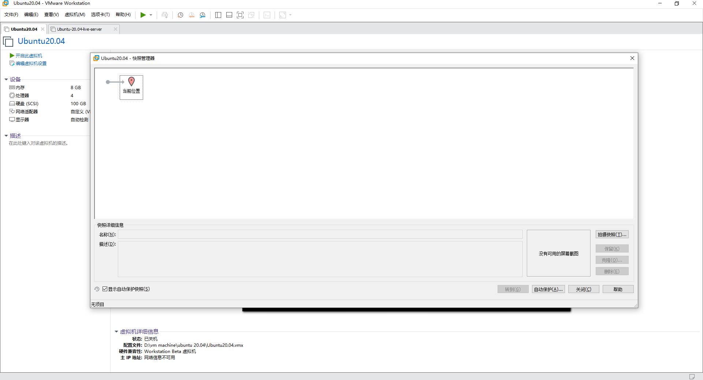
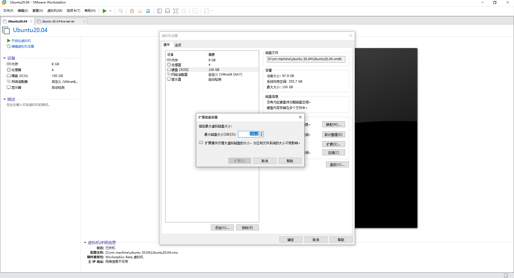
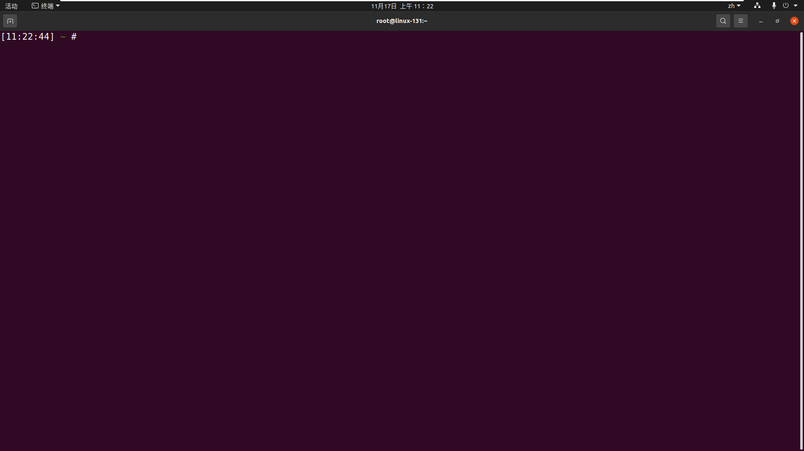
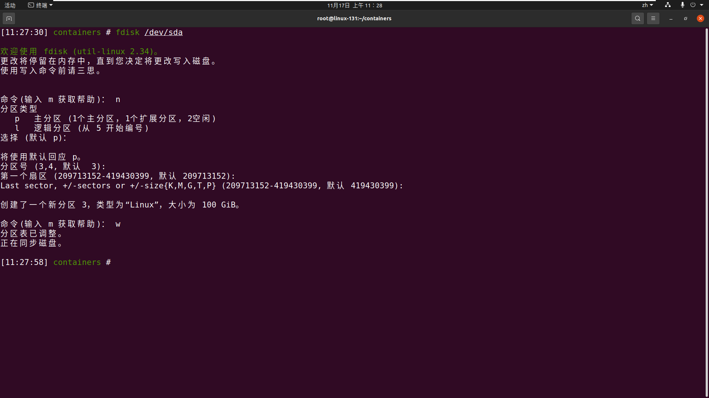
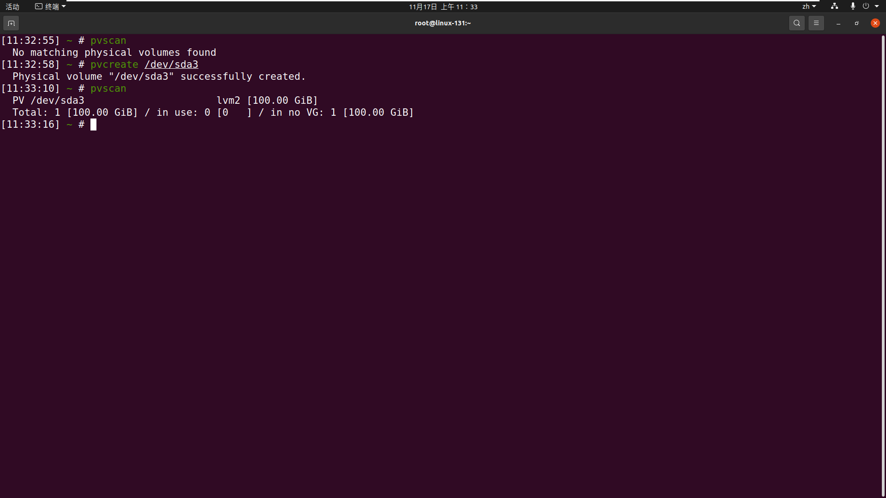

# linux 硬盘相关的操作

## ubuntu 虚拟机扩展磁盘

[comment]: <挂载到某分区> (https://www.jianshu.com/p/13f59261e343)

[comment]: <将新磁盘合并到/> (https://dotponder.github.io/ubuntu_expand_disk/)

### 步骤-以虚拟机(ubuntu20.04)为例

1. 确保当前虚拟机不存在快照



2. 虚拟机设置-> 磁盘 -> 扩展磁盘



3. 开启虚拟机并打开终端



4. 用fdisk创建新分区

* fdisk /dev/sda 进入fdisk工具
* 指创建物理上的分区(Partition)
* 进入fdisk后，command输入n，代表要新建分区
* 回车，主分区创建
* 按下3，回车，再跳过两个默认的选项，最后键入w回车保存。这样，新的分区3就创建好了。
* 全程命令展示

```text
[11:27:30] containers # fdisk /dev/sda

欢迎使用 fdisk (util-linux 2.34)。
更改将停留在内存中，直到您决定将更改写入磁盘。
使用写入命令前请三思。


命令(输入 m 获取帮助)： n
分区类型
   p   主分区 (1个主分区，1个扩展分区，2空闲)
   l   逻辑分区 (从 5 开始编号)
选择 (默认 p)： 

将使用默认回应 p。
分区号 (3,4, 默认  3): 
第一个扇区 (209713152-419430399, 默认 209713152): 
Last sector, +/-sectors or +/-size{K,M,G,T,P} (209713152-419430399, 默认 419430399): 

创建了一个新分区 3，类型为“Linux”，大小为 100 GiB。

命令(输入 m 获取帮助)： w
分区表已调整。
正在同步磁盘。
```



5. 用pvcreat创建物理卷

意为，在分区上标记：这个分区是空闲的

```shell
pvcreate /dev/sda4
```

* 运行结束后，可以用pvscan查看一下物理卷的情况：

```shell
pvscan
```



6. 用pvcreat创建物理卷


7. 用lvextend给逻辑卷扩容


8. 用lvextend给逻辑卷扩容

## linux挂在单独硬盘到指定目录

* 假设挂在新硬盘到/data目录，此时 有三块硬盘 sda sdb sdc sda系统 sdb单独/home sdc挂在/data

### 步骤

```shell
# 1.创建分区 
sudo fdisk /dev/sdc # 先执行这个 后续依次输入
n      # 新建分区
p      # 主分区
<Enter> # 默认分区号 1
<Enter> # 默认起始扇区
<Enter> # 默认结束扇区（使用全部空间）
w      # 写入并退出


# 2.格式化为 ext4 文件系统 
sudo mkfs.ext4 /dev/sdc1


# 3.创建挂载点 /data
sudo mkdir -p /data


# 4.临时挂载测试
sudo mount /dev/sdc1 /data

# 5.验证是否成功
df -h /data
# 结果
# Filesystem      Size  Used Avail Use% Mounted on
# /dev/sdc1       295G   73M  280G   1% /data

# 6.设置开机自动挂载
# 6.1获取 UUID
sudo blkid /dev/sdc1
# 结果
# /dev/sdc1: UUID="92cdb89e-5d9c-427b-867f-7f2942b89f41" TYPE="ext4" PARTUUID="d1e8ffc2-01"

# 6.2编辑 fstab
sudo nano /etc/fstab
# 文件末尾添加一行
# UUID=a1b2c3d4-e5f6-7890-g1h2-i3j4k5l6m7n8  /data  ext4  defaults  0  2

# 6.3测试 fstab 是否正确
sudo mount -a

# 7.设置权限
sudo chown -R $USER:$USER /data
```

## lvm挂载

```text
sudo fdisk /dev/sdb
sudo mkfs -t ext4 /dev/sdb

fdisk /dev/sdx
sudo mkfs -t ext4 /dev/sdb

/dev/ubuntu-vg/ubuntu-lv

如果硬盘完全使用完情况下使用此命令，如果有多余的空间请跳过此命令：
lvresize -A n -L +30G /dev/mapper/ubuntu--vg-ubuntu--lv
resize2fs -p /dev/mapper/ubuntu--vg-ubuntu--lv


dmsetup remove_all

sudo vgextend ubuntu-vg /dev/sdb
vgextend ubuntu-vg /dev/sdc


sudo lvextend -l +100%FREE /dev/ubuntu-vg/ubuntu-lv
sudo resize2fs /dev/ubuntu-vg/ubuntu-lv

```

## 占位
