<a id = "top"></a>

# 安装linux虚拟机

----

## 目录

* [安装前准备](#1)
* [桌面版本安装](#2)
* [服务器版本安装](#3)

<a id = "1"></a>

## 安装前准备

1.获取 ubuntu 20.04 镜像

```text
 ubuntu 官网： https://ubuntu.com/
 aliyun 镜像： http://mirrors.aliyun.com/ubuntu-releases/20.04/
 清华 镜像：    https://mirrors.tuna.tsinghua.edu.cn/ubuntu-releases/20.04.5/
```

2. 安装vmware workstation 16

```text
下载地址： https://www.vmware.com/cn/products/workstation-pro.html
```


3. 安装 vmware workstation

```text
安装路径记得切换
全程下一步 默认安装
```

<a id = "2"></a>
### desktop ubuntu 20.04

```text
最开始选择自定义 
存储位置进行切换
大小建议100G
其余基本下一步
```

* 
* 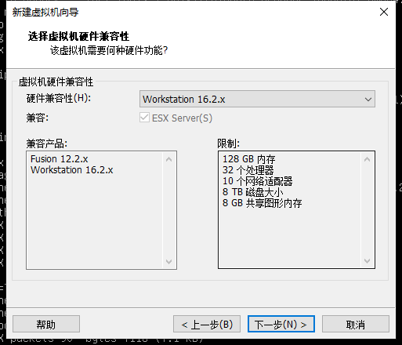
* 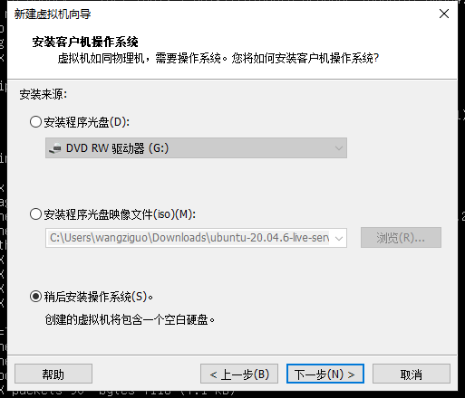
* 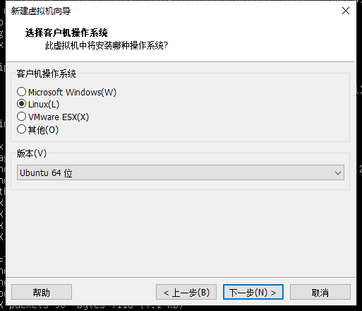
* 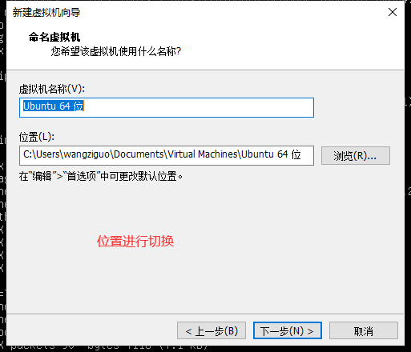
* 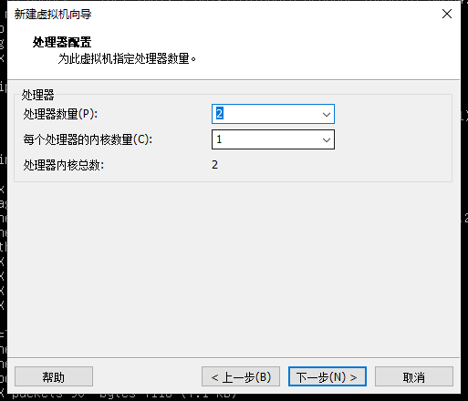
* 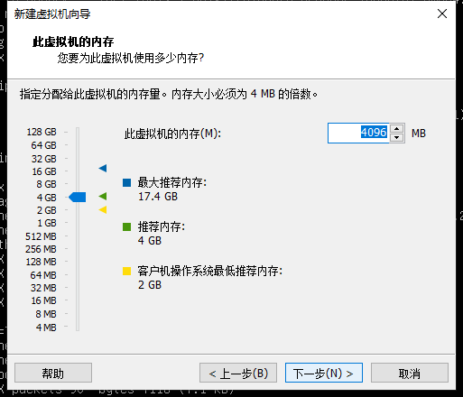
* 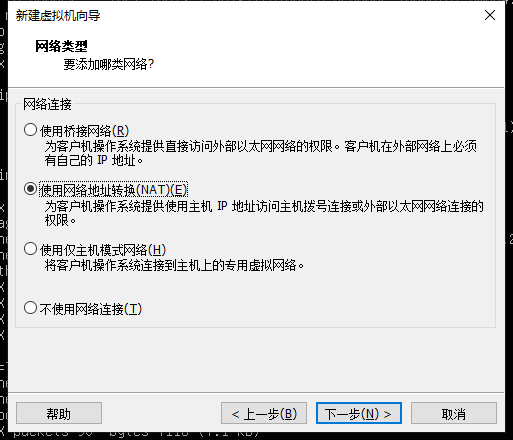
* 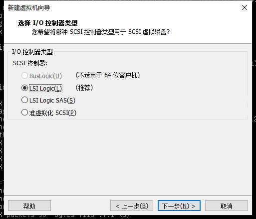
* 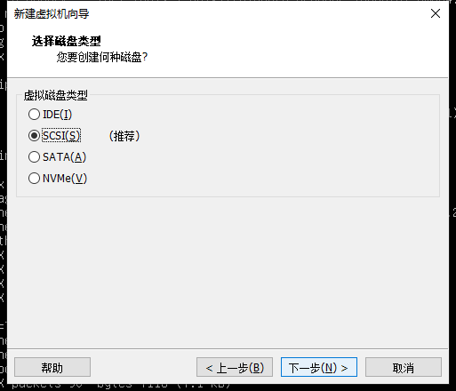
* 
* 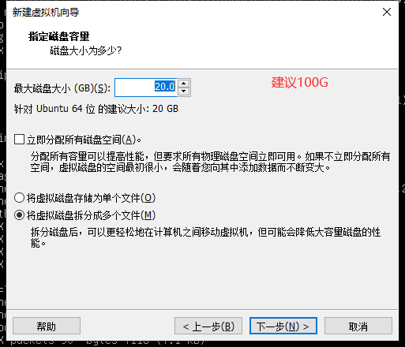
* 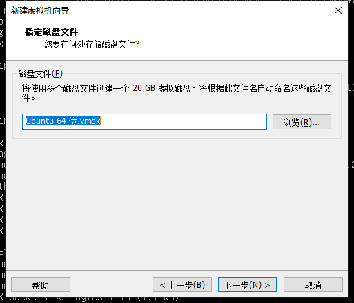
* 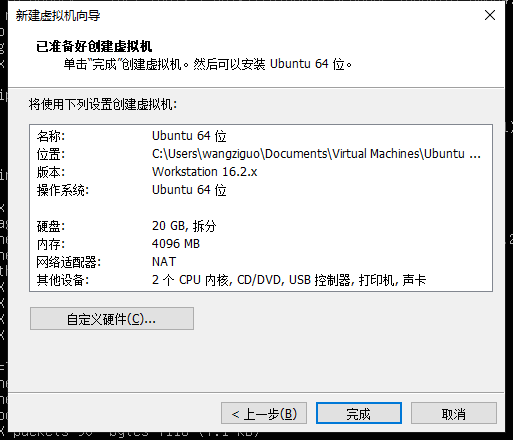

<a id = "3"></a>
### live-server ubuntu 20.04

```text
最开始选择自定义 
存储位置进行切换
大小建议100G
其余基本下一步
```

* 
* 
* 
* 
* 
* 
* 
* 
* 
* 
* 
* 
* 
* 
* 启动虚拟机
* 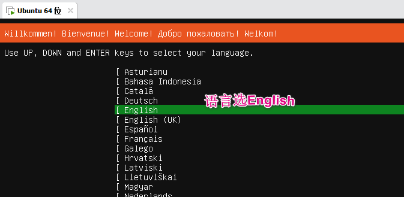
* 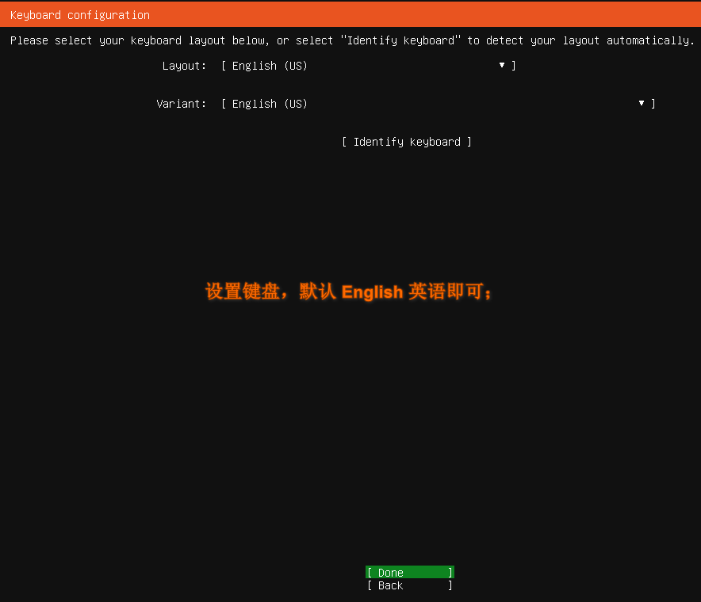
* 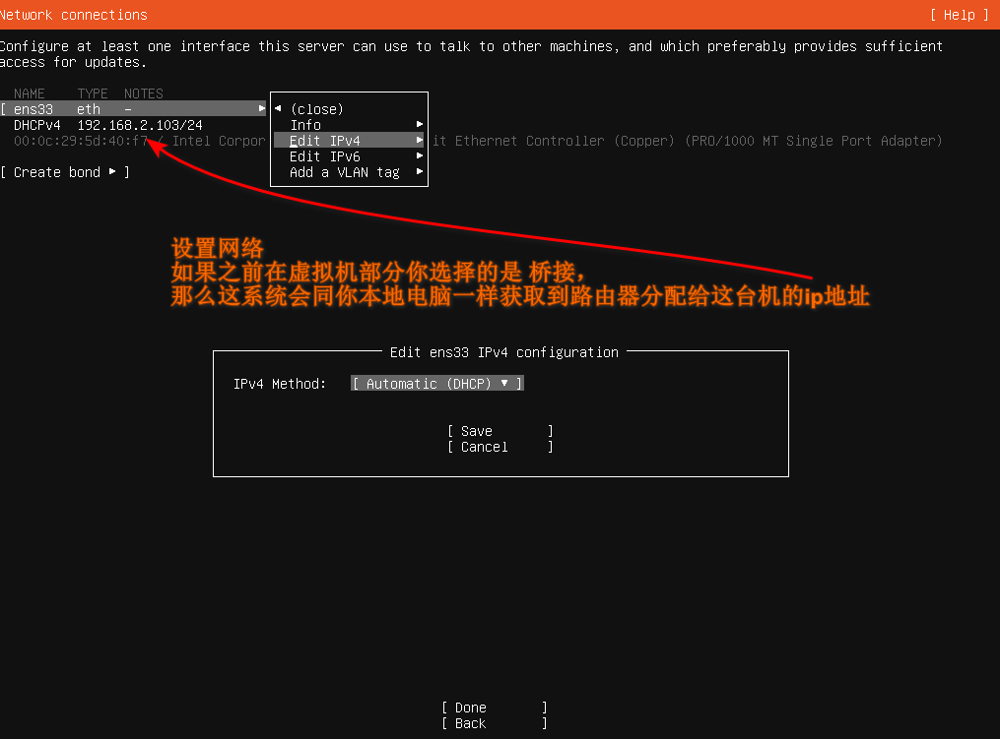
* 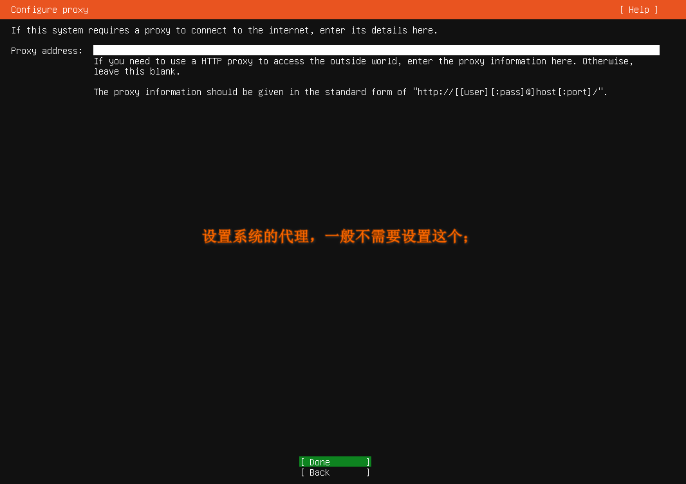
* 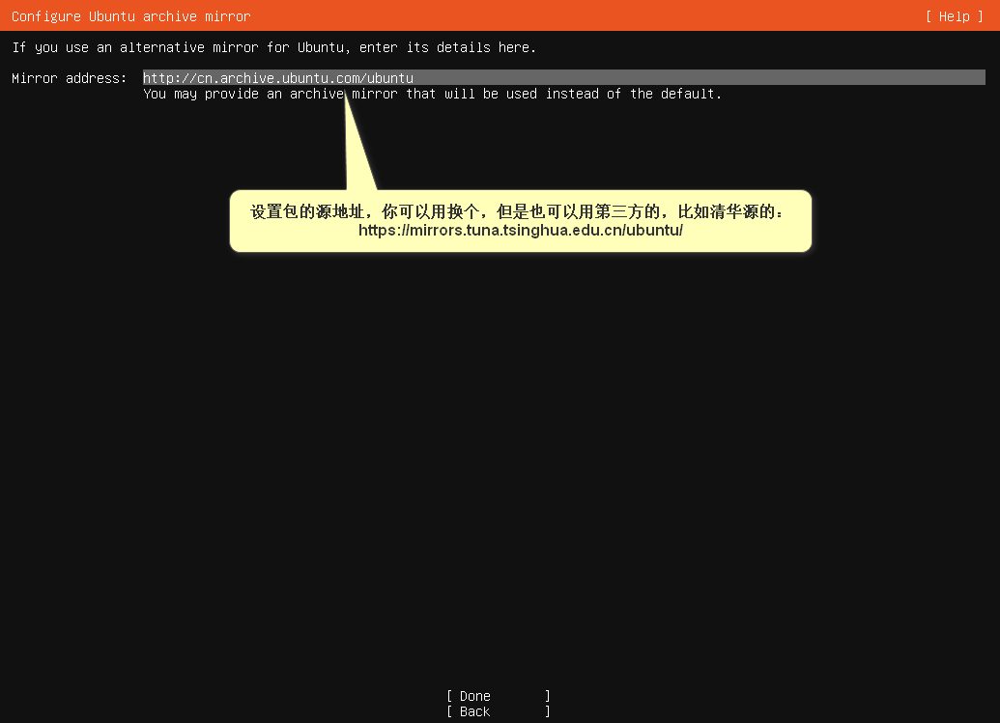
* 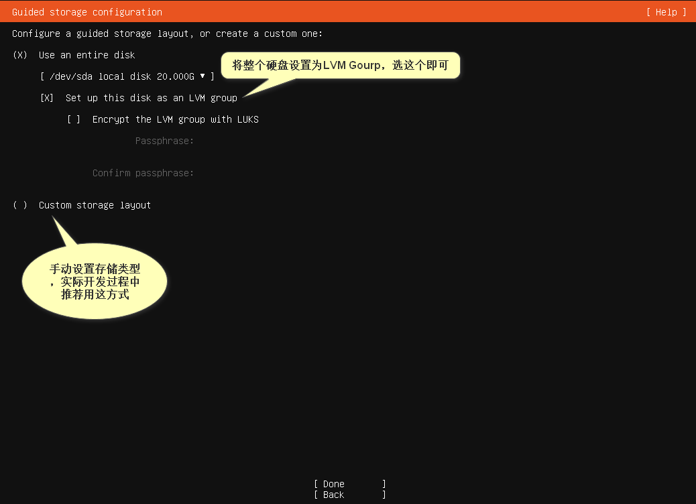
* 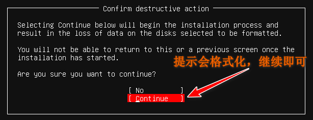
* 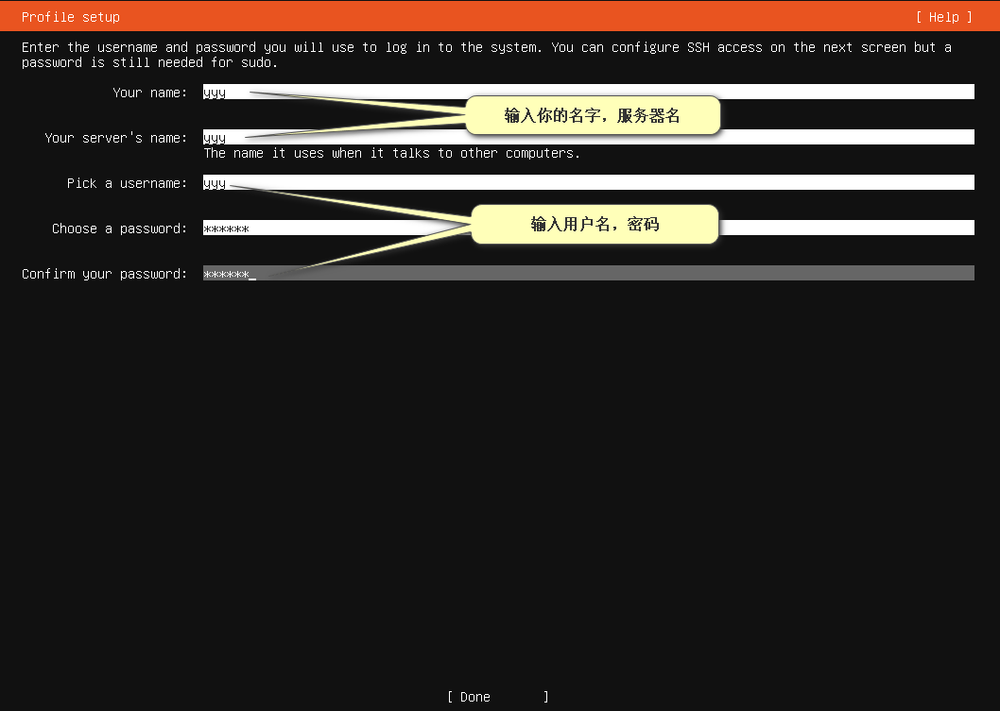
* 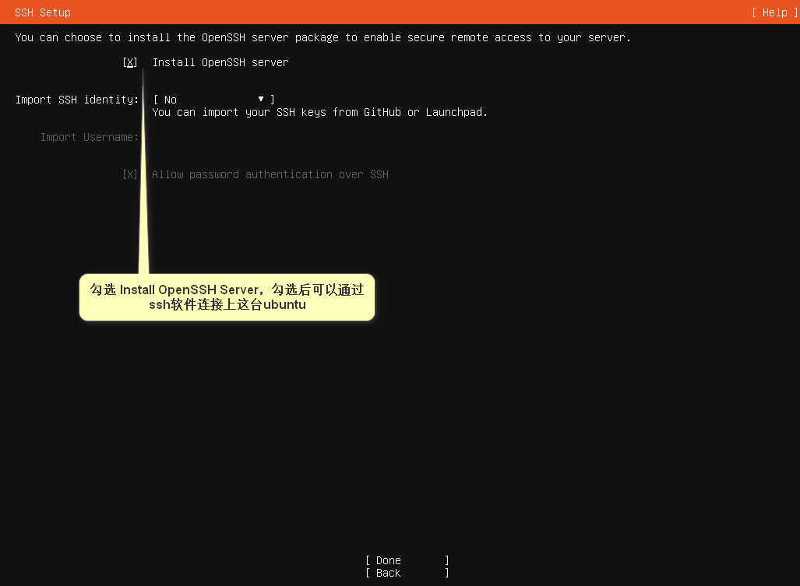
* 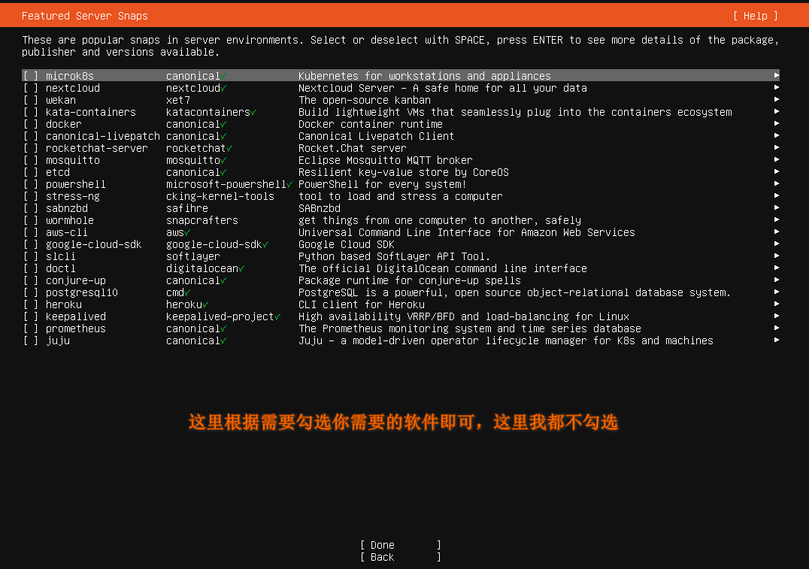
* 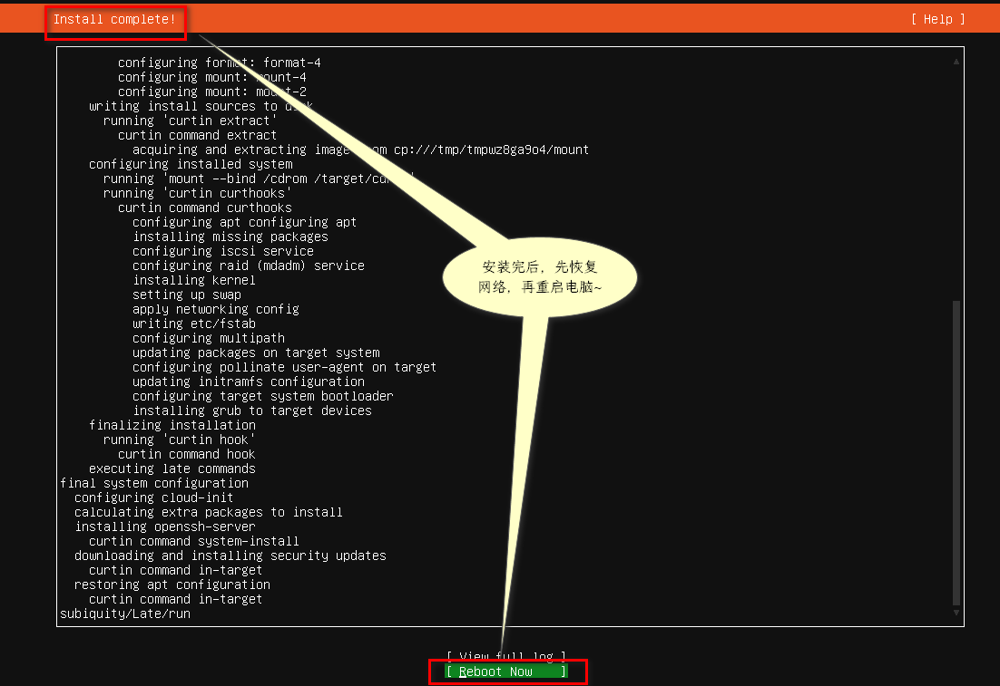
* 下方图 敲击enter
* 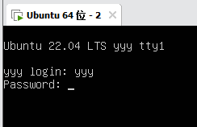
* 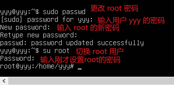
* 终端执行下方命令

```shell
apt install open-vm-tools vim net-tools
vi /etc/ssh/sshd_config
```
* 进行修改
* 
```shell
esc
:wq
ifconfig -a
```
* 
* 记录上方ip xshell 工具需使用

[ ⬆ ](#top)