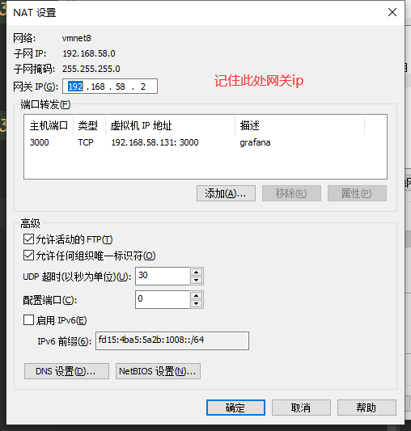
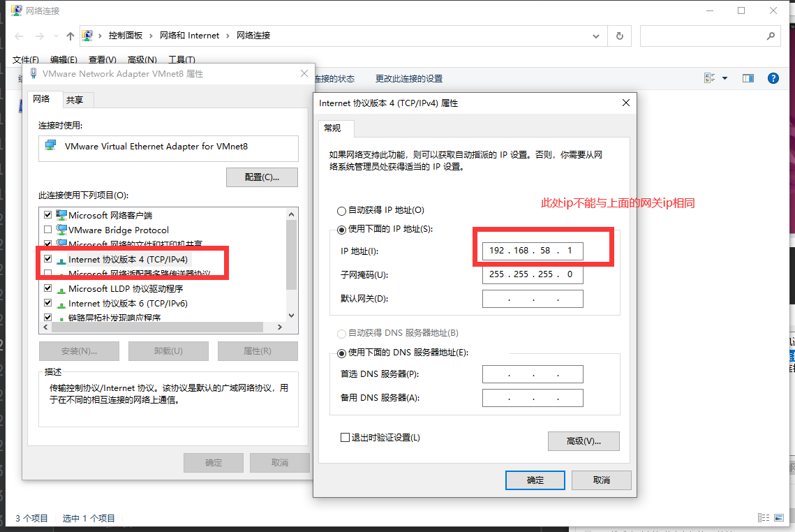
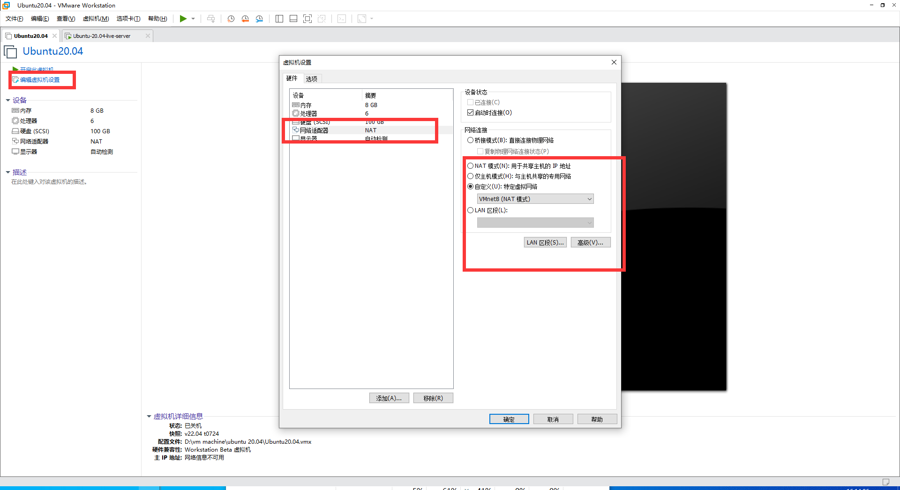
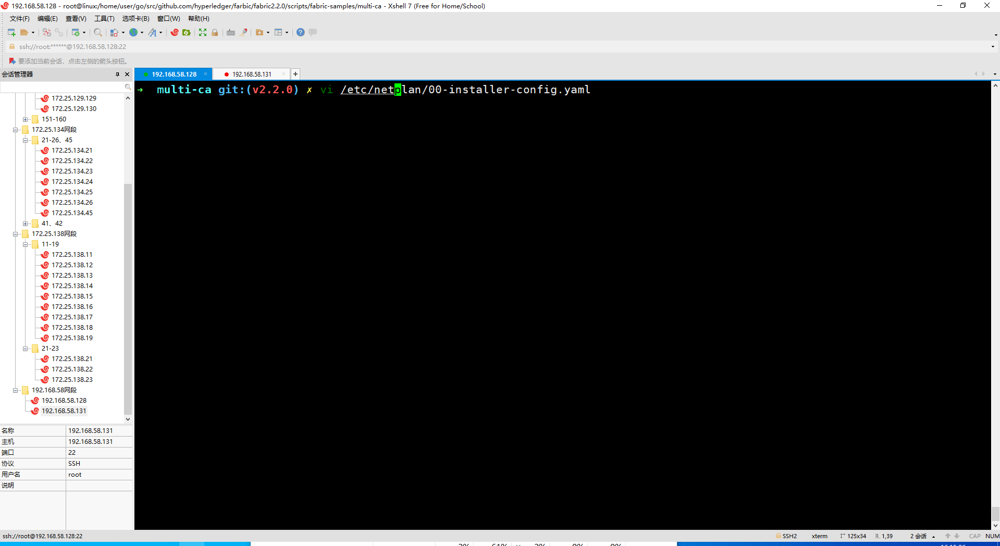

### ubuntu配置静态ip

#### 步骤1

在虚拟机关闭状态下，配置


#### 步骤2


#### 步骤3


#### 步骤4



#### 步骤5


#### 步骤6



#### 步骤7



#### 步骤8

启动虚拟机

#### 步骤9




查看当前配置文件名称
```bash
ip a
```
查看ip a结果，观察服务名是ens33 还是ens32 还是其他
lo为本地环路
Tips: 此处是名称ensxx为下方内容中ethernets下方的名称，若不进行对应，使用netplan apply 无法生效


<br/>
内容:
</br>

```yaml
# This is the network config written by 'subiquity'
network:
  ethernets:
    ens33:
      dhcp4: false
      dhcp6: false
      
      addresses:
        #        此处是本机ip
        - 192.168.58.128/24
      #22.04使用这里      新版本ubuntu系统中此处是网关设置
      routes:
        - to: default
          via: 192.168.58.2
          
      # 20.04版本使用这里
      # gateway4: 192.168.58.2
      nameservers:
        addresses: [ 192.168.58.2 ]
        search: [ ]
  version: 2

```

hosts 文件


```text
127.0.0.1 localhost
# 将127.0.1.1 后面的文字修改为不同于其他机器的文字
127.0.1.1 linux-128
::1     ip6-localhost ip6-loopback
fe00::0 ip6-localnet
ff00::0 ip6-mcastprefix
ff02::1 ip6-allnodes
ff02::2 ip6-allrouters

```

#### 步骤10

执行下面命令

```text
应用修改是设置，正确配置部署处处任何信息
有输出信息就是配置不正确
netplan apply

# 重启网关
systemctl restart systemd-networkd.service
```

#### 步骤11

在步骤4端口转发中配置自己要访问你的端口
</br>方式: 虚拟机ip:虚拟机port
</br>访问方式: 宿主机ip:暴露端口

### ubuntu配置dns服务

#### 步骤1

编辑/etc/systemd/resolved.conf文件

```text
#  This file is part of systemd.
#
#  systemd is free software; you can redistribute it and/or modify it under the
#  terms of the GNU Lesser General Public License as published by the Free
#  Software Foundation; either version 2.1 of the License, or (at your option)
#  any later version.
#
# Entries in this file show the compile time defaults. Local configuration
# should be created by either modifying this file, or by creating "drop-ins" in
# the resolved.conf.d/ subdirectory. The latter is generally recommended.
# Defaults can be restored by simply deleting this file and all drop-ins.
#
# Use 'systemd-analyze cat-config systemd/resolved.conf' to display the full config.
#
# See resolved.conf(5) for details.

[Resolve]
# Some examples of DNS servers which may be used for DNS= and FallbackDNS=:
# Cloudflare: 1.1.1.1#cloudflare-dns.com 1.0.0.1#cloudflare-dns.com 2606:4700:4700::1111#cloudflare-dns.com 2606:4700:4700::1001#cloudflare-dns.com
# Google:     8.8.8.8#dns.google 8.8.4.4#dns.google 2001:4860:4860::8888#dns.google 2001:4860:4860::8844#dns.google
# Quad9:      9.9.9.9#dns.quad9.net 149.112.112.112#dns.quad9.net 2620:fe::fe#dns.quad9.net 2620:fe::9#dns.quad9.net


DNS=192.168.58.2,114.114.114.114


#FallbackDNS=
#Domains=
#DNSSEC=no
#DNSOverTLS=no
#MulticastDNS=no
#LLMNR=no
#Cache=no-negative
#CacheFromLocalhost=no
#DNSStubListener=yes
#DNSStubListenerExtra=
#ReadEtcHosts=yes
#ResolveUnicastSingleLabel=no
```

#### 步骤2

备份/etc/resolv.conf

```text

mv /etc/resolv.conf /etc/resolv.conf.bak
```

#### 步骤3

重启解析服务

```text
systemctl restart systemd-resolved
```

#### 步骤4

建立软连接到步骤1的文件位置

```text
ln -s /run/systemd/resolve/resolv.conf /etc/
```

#### 步骤5

重启网关

```text

systemctl restart systemd-networkd
```

#### 步骤6

验证

```text
ping www.baidu.com
```

### 注意事项:

```text
在配置完上述流程后，若要局域网访问，需要关闭物理机的防火墙
```