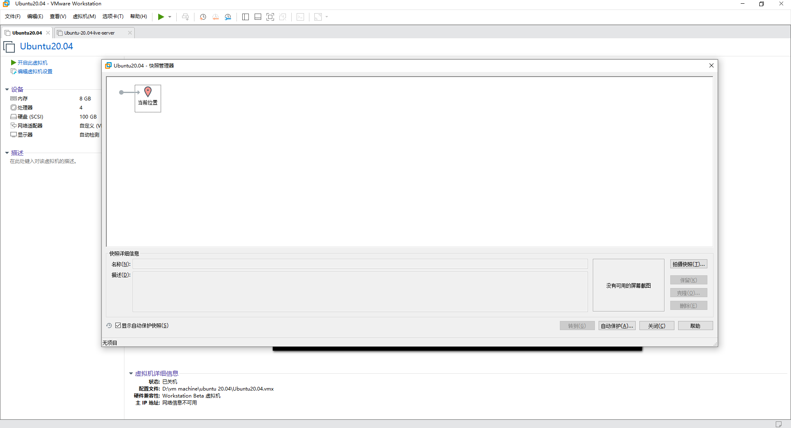
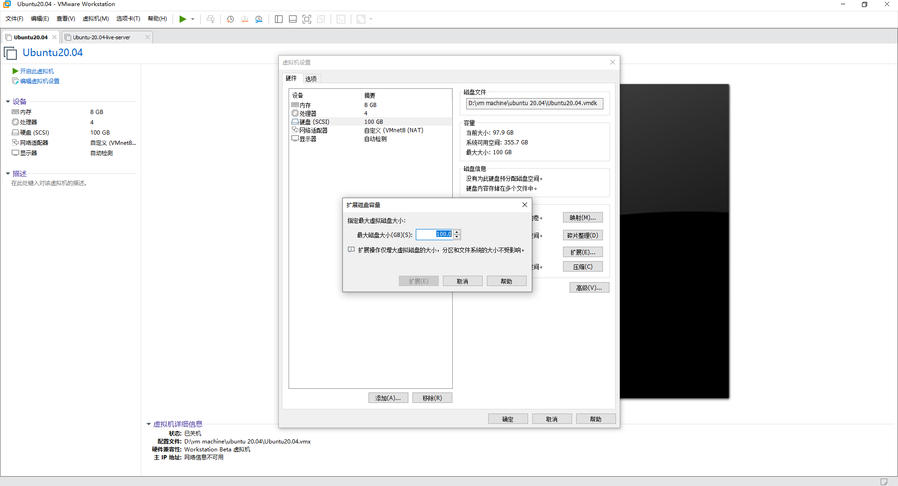
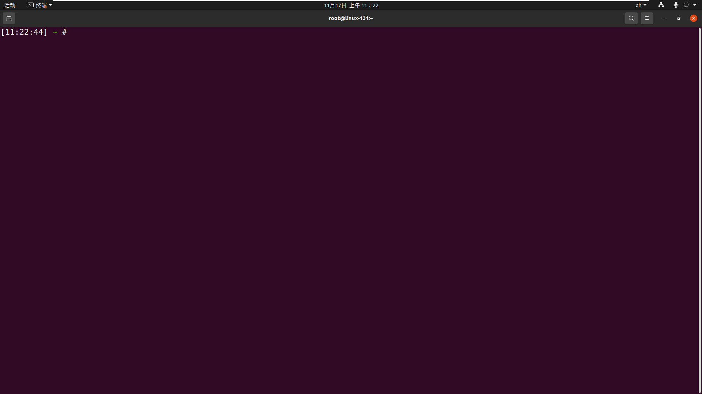
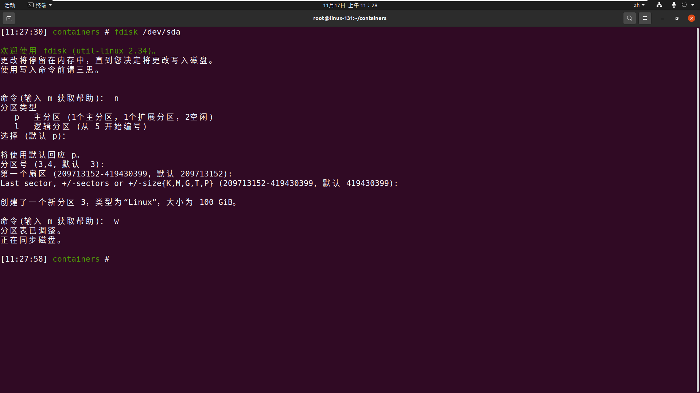
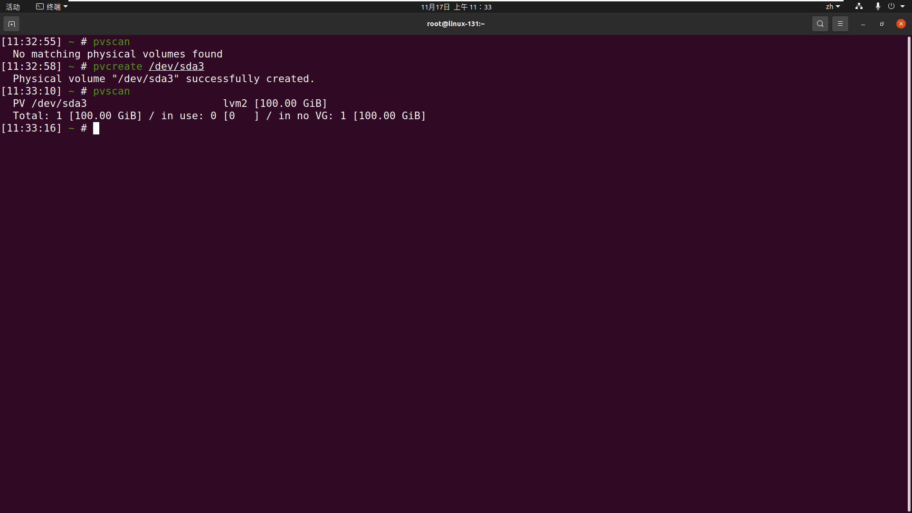

# ubuntu虚拟机扩展磁盘

[comment]: <挂载到某分区> (https://www.jianshu.com/p/13f59261e343)

[comment]: <将新磁盘合并到/> (https://dotponder.github.io/ubuntu_expand_disk/)

## 步骤 以虚拟机(ubuntu20.04)为例

1. 确保当前虚拟机不存在快照



2. 虚拟机设置-> 磁盘 -> 扩展磁盘



3. 开启虚拟机并打开终端



4. 用fdisk创建新分区

* fdisk /dev/sda 进入fdisk工具
* 指创建物理上的分区(Partition)
* 进入fdisk后，command输入n，代表要新建分区
* 回车，主分区创建
* 按下3，回车，再跳过两个默认的选项，最后键入w回车保存。这样，新的分区3就创建好了。
* 全程命令展示

```text
[11:27:30] containers # fdisk /dev/sda

欢迎使用 fdisk (util-linux 2.34)。
更改将停留在内存中，直到您决定将更改写入磁盘。
使用写入命令前请三思。


命令(输入 m 获取帮助)： n
分区类型
   p   主分区 (1个主分区，1个扩展分区，2空闲)
   l   逻辑分区 (从 5 开始编号)
选择 (默认 p)： 

将使用默认回应 p。
分区号 (3,4, 默认  3): 
第一个扇区 (209713152-419430399, 默认 209713152): 
Last sector, +/-sectors or +/-size{K,M,G,T,P} (209713152-419430399, 默认 419430399): 

创建了一个新分区 3，类型为“Linux”，大小为 100 GiB。

命令(输入 m 获取帮助)： w
分区表已调整。
正在同步磁盘。
```



5. 用pvcreat创建物理卷

意为，在分区上标记：这个分区是空闲的

```shell
pvcreate /dev/sda4
```

* 运行结束后，可以用pvscan查看一下物理卷的情况：

```shell
pvscan
```



6. 用pvcreat创建物理卷


7. 用lvextend给逻辑卷扩容


8. 用lvextend给逻辑卷扩容


