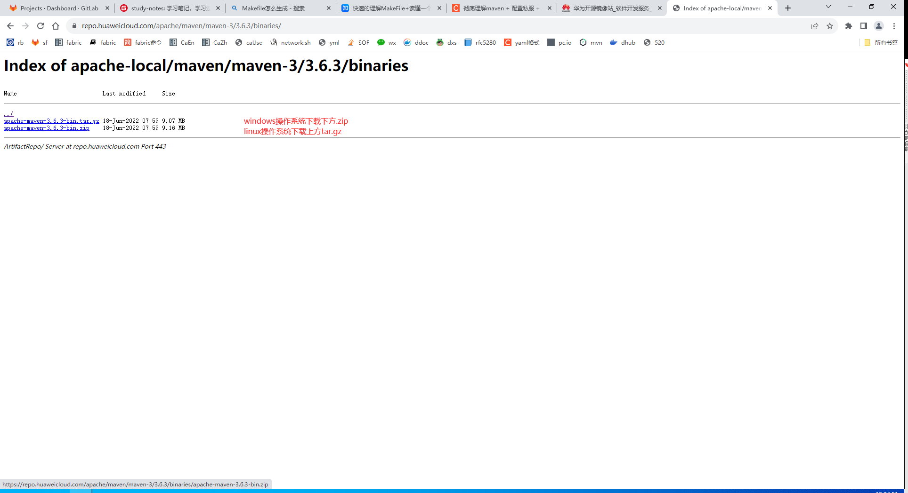
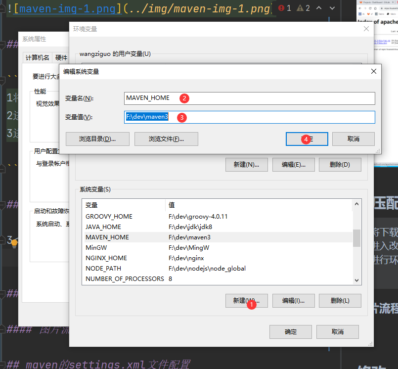
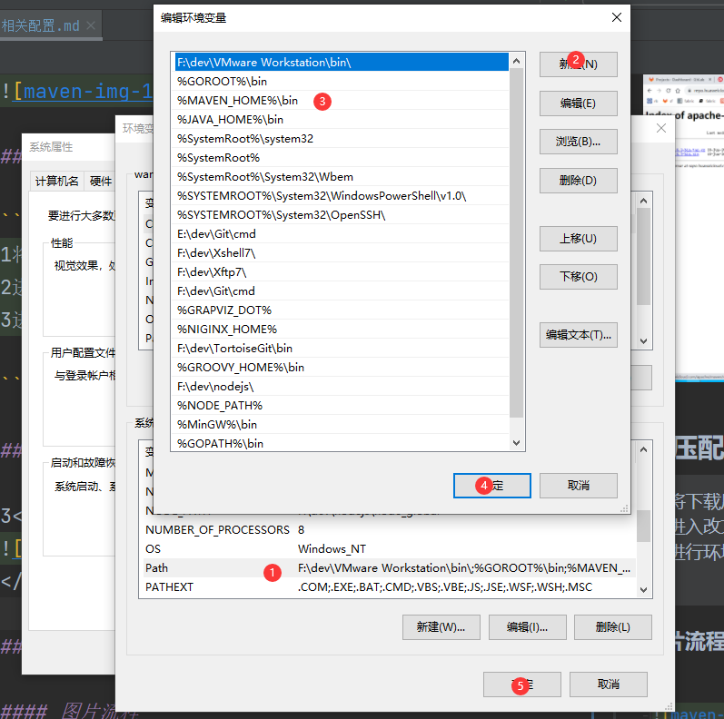

# maven 相关配置

## 配置流程

### 下载maven

```text
下载路径: 
maven3.6.3
https://repo.huaweicloud.com/apache/maven/maven-3/3.6.3/binaries/

其他版本华为代理:
https://repo.huaweicloud.com/apache/maven/
```

#### 图片流程



### 解压配置maven

```text
1将下载压缩包解压到电脑指定路径(自定)
2进入改文件夹 拷贝文件夹路径
3进行环境配置

```

#### 图片流程

3</br>

</br>


### 修改maven配置文件

```text
将下方 配置文件拷贝到maven安装路径(解压路径)/conf/settings.xml文件
```

## maven的settings.xml文件配置

```xml
<?xml version="1.0" encoding="UTF-8"?>
<settings xmlns="http://maven.apache.org/SETTINGS/1.2.0" xmlns:xsi="http://www.w3.org/2001/XMLSchema-instance"
          xsi:schemaLocation="http://maven.apache.org/SETTINGS/1.2.0 https://maven.apache.org/xsd/settings-1.2.0.xsd">
    <!--<localRepository>这里输入repo文件夹路径，即本地maven仓库</localRepository>-->
    <localRepository>F:\repo</localRepository>
    <pluginGroups>
    </pluginGroups>
    <proxies>
    </proxies>
    <servers>
        <!--<server>-->
        <!--    <id>私服id</id>-->
        <!--    <username>私服用户名</username>-->
        <!--    <password>私服密码</password>-->
        <!--</server>-->
    </servers>
    <mirrors>
        <mirror>
            <id>aliyun-mirror</id>
            <url>https://maven.aliyun.com/repository/public</url>
            <name>aliyun-cloud-maven-mirror</name>
            <!--代理规则-->
            <mirrorOf>central,!jitpack.io</mirrorOf>
        </mirror>
        <mirror>
            <id>jitpack.io-mirror</id>
            <url>https://www.jitpack.io</url>
            <name>jitpack mirror for github</name>
            <!--代理规则-->
            <mirrorOf>jitpack.io</mirrorOf>
        </mirror>
        <!--<mirror>-->
        <!--    <id>私服id</id>-->
        <!--    <mirrorOf>代理规则</mirrorOf>-->
        <!--    <name>私服名称</name>-->
        <!--    <url>私服地址</url>-->
        <!--</mirror>-->
        <!--举例-->
        <!--<mirror>-->
        <!--    <id>my-repo</id>-->
        <!--mirrorOf 中的值 必须是在下方repository中id中-->
        <!--<mirrorOf>my-repo-java</mirrorOf>-->
        <!--<name>我的私服</name>-->
        <!--<url>https://example.com/maven/public/</url>-->
        <!--</mirror>-->
    </mirrors>

    <profiles>
        <profile>
            <id>compiler</id>
            <activation>
                <activeByDefault>true</activeByDefault>
                <jdk>1.8</jdk>
            </activation>
            <properties>
                <!--java编译环境-->
                <!--JAVA_HOME需指向本机java安装路径-->
                <JAVA_HOME>F:\dev\jdk\jdk8</JAVA_HOME>
                <maven.compiler.source>1.8</maven.compiler.source>
                <maven.compiler.target>1.8</maven.compiler.target>
                <maven.compiler.compilerVersion>1.8</maven.compiler.compilerVersion>
            </properties>
        </profile>
        <profile>
            <!--profile的id -->
            <id>dev</id>
            <repositories>
                <!--此处的repository顺序决定在解析依赖的先后顺序-->
                <!--<repository>-->
                <!--    <id>my-repo-java</id>-->
                <!--用于mirrorOf中-->
                <!--    <url>https://example.com/maven/public/</url>-->
                <!--    <releases>-->
                <!--        <enabled>true</enabled>-->
                <!--    </releases>-->
                <!--    <snapshots>-->
                <!--        <enabled>true</enabled>-->
                <!--    </snapshots>-->
                <!--</repository>-->


                <!--<repository>-->
                <!--    <id>私服id</id>-->
                <!--用于mirrorOf中-->
                <!--    <url>私服地址</url>-->
                <!--    <releases>-->
                <!--        <enabled>true</enabled>-->
                <!--    </releases>-->
                <!--    <snapshots>-->
                <!--        <enabled>true</enabled>-->
                <!--    </snapshots>-->
                <!--</repository>-->

                <repository>
                    <id>central</id>
                    <name>Aliyun Maven Repository</name>
                    <url>https://maven.aliyun.com/repository/public</url>
                    <snapshots>
                        <enabled>false</enabled>
                    </snapshots>
                    <releases>
                        <enabled>true</enabled>
                    </releases>
                </repository>
                <repository>
                    <id>jitpack.io</id>
                    <name>jitpack mirror for github</name>
                    <url>https://www.jitpack.io</url>
                    <snapshots>
                        <enabled>false</enabled>
                    </snapshots>
                    <releases>
                        <enabled>true</enabled>
                    </releases>
                </repository>
            </repositories>

            <pluginRepositories>
                <!-- 插件仓库，maven的运行依赖插件，也需要从私服下载插件 -->
                <!--<pluginRepository>-->
                <!-- 插件仓库的id不允许重复，如果重复后边配置会覆盖前边 -->
                <!--<id>私服id</id>-->
                <!--<name>私服名称</name>-->
                <!--<url>私服地址</url>-->
                <!--</pluginRepository>-->
                <!--阿里云maven插件-->
                <pluginRepository>
                    <id>aliyun-plugin</id>
                    <url>https://maven.aliyun.com/repository/public</url>
                    <releases>
                        <enabled>true</enabled>
                    </releases>
                    <snapshots>
                        <enabled>false</enabled>
                    </snapshots>
                </pluginRepository>
            </pluginRepositories>
        </profile>
    </profiles>
    <activeProfiles>
        <activeProfile>compiler</activeProfile>
        <activeProfile>dev</activeProfile>
    </activeProfiles>
</settings>
```

## 文章链接

[彻底理解maven + 配置私服 + 阿里云镜像](https://blog.csdn.net/sjsh_csdn/article/details/119562070)
