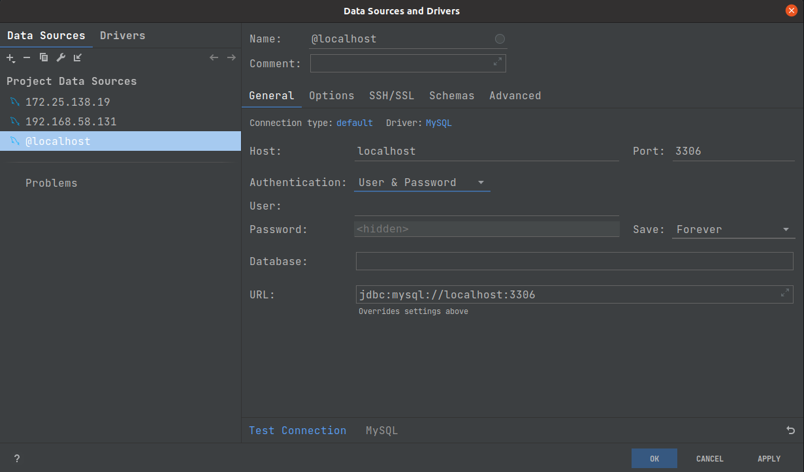

# MyBatisX插件使用

## 步骤

1. 安装插件

> JetBrains系列IDE软件
>
>> File -> Settings -> Plugins -> Marketplace -> MyBatisX

2. 连接数据库

> JetBrains系列IDE软件
>
>> 
>
>> 

3. 选择要逆向生成的表

> 以nunu库user表做演示
>
> 在user表右键
>
>> 
>
> 选择MybatisX-Generator
>
> 注意点:
> 1 base package 填写 Application所在包名 
> 2 base path 保持src/main/java不变 
> 3 relative package 实体类包名 如 entity 
> 4 extra class suffix 实体类后缀 如 Entity 
> 5 class name strategy 选择camel / same as tablename 
>
>> 
>
>  点击下一步
>
> 注意点
> 1 annotation 注解类型 按需选 
> 2 options 选项 按需选 
> 3 template 模板 按需选 
>> 
>
> 点击finish